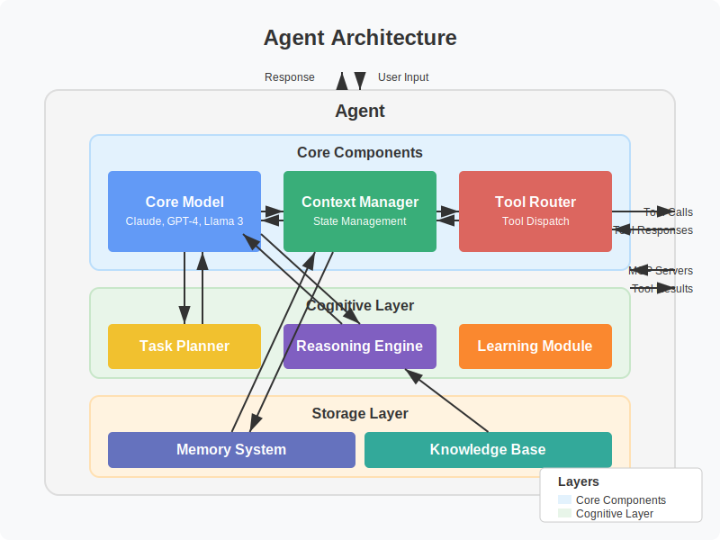
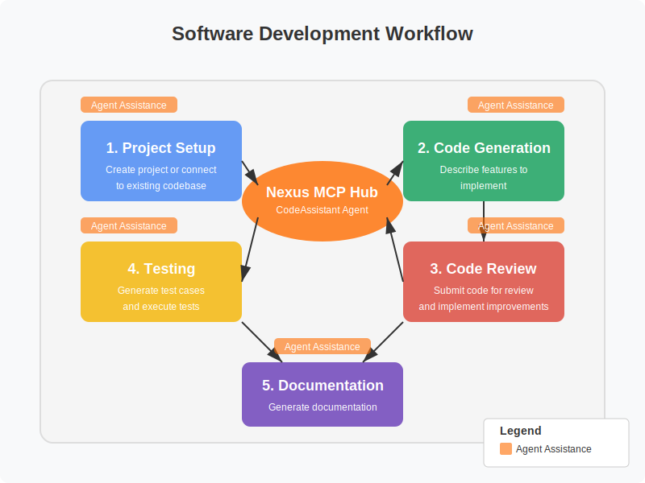

# Agent Types

## Introduction

The Nexus MCP Hub supports various types of AI agents, each designed for specific tasks and use cases. This document describes the different types of agents, their capabilities, and how they can be used in the Nexus ecosystem.



## Coding Agents

Coding agents are specialized in software development tasks, helping users write, review, and debug code.

### Overview

- **Primary Capabilities**: Code generation, code review, code explanation, code refactoring, code debugging
- **MCP Servers**: Ollama MCP, Terminal MCP, Code Sandbox
- **Models**: Claude 3 Sonnet, GPT-4, Llama 3 70B

### Key Features

- Generate code based on natural language descriptions
- Review existing code for bugs, security issues, and style violations
- Explain complex code snippets
- Refactor code for better performance and maintainability
- Debug issues in code

### Use Cases

- Software development
- Code review and quality assurance
- Learning programming concepts
- Technical documentation
- Prototyping and experimentation

### Example Agent: CodeAssistant

CodeAssistant is an advanced coding agent powered by Claude 3 Sonnet.



```json
{
  "id": "code-assistant",
  "name": "CodeAssistant",
  "description": "Advanced coding agent for software development tasks",
  "type": "coding",
  "model": "claude-3-sonnet",
  "mcpServers": ["ollama-mcp", "code-sandbox"],
  "capabilities": [
    "code-generation",
    "code-review",
    "code-explanation",
    "code-refactoring",
    "code-debugging"
  ],
  "parameters": {
    "temperature": 0.7,
    "maxTokens": 8192,
    "topP": 0.95
  },
  "benchmarks": {
    "humanEval": 78.5,
    "codeXGLUE": 72.3,
    "mbpp": 81.2
  }
}
```

### Example Task

```
Task: "Create a function that calculates the Fibonacci sequence up to n terms"

Response:
```javascript
function fibonacci(n) {
  if (n <= 0) return [];
  if (n === 1) return [0];
  if (n === 2) return [0, 1];

  const result = [0, 1];
  for (let i = 2; i < n; i++) {
    result.push(result[i-1] + result[i-2]);
  }

  return result;
}
```
```

## Research Agents

Research agents are focused on information retrieval, analysis, and synthesis from various sources.

### Overview

- **Primary Capabilities**: Web search, document retrieval, document summarization, knowledge graph
- **MCP Servers**: Supabase MCP, Terminal MCP
- **Models**: Claude 3 Opus, GPT-4

### Key Features

- Search the web for information
- Retrieve and analyze documents
- Summarize lengthy content
- Build knowledge graphs
- Synthesize information from multiple sources

### Use Cases

- Academic research
- Market research
- Competitive analysis
- Literature review
- Trend analysis

### Example Agent: Librarian

Librarian is an advanced research agent powered by Claude 3 Opus.

```json
{
  "id": "librarian",
  "name": "Librarian",
  "description": "Research agent for information retrieval and analysis",
  "type": "research",
  "model": "claude-3-opus",
  "mcpServers": ["supabase-mcp", "terminal-mcp"],
  "capabilities": [
    "web-search",
    "document-retrieval",
    "document-summarization",
    "knowledge-graph"
  ],
  "parameters": {
    "temperature": 0.5,
    "maxTokens": 12000,
    "topP": 0.9
  },
  "benchmarks": {
    "mmlu": 86.7,
    "truthfulQA": 92.1,
    "gsm8k": 79.8
  }
}
```

### Example Task

```
Task: "Find recent research on quantum computing applications in cryptography"

Response:
Recent Research on Quantum Computing Applications in Cryptography (2022-2023):

1. "Post-Quantum Cryptography: Current State and Quantum Mitigation Techniques" (2023)
   - Authors: Zhang et al.
   - Key findings: Comprehensive review of quantum-resistant algorithms

2. "Quantum Key Distribution: From Theory to Application" (2022)
   - Authors: Johnson et al.
   - Key findings: Practical implementation of QKD in existing networks

3. "Lattice-Based Cryptography Against Quantum Attacks" (2023)
   - Authors: Patel et al.
   - Key findings: New lattice-based schemes with improved security margins

4. "Quantum-Safe Blockchain: Protecting Distributed Ledgers" (2022)
   - Authors: Kim et al.
   - Key findings: Integration of post-quantum signatures in blockchain
```

## Database Agents

Database agents are experts in data management, querying, and analysis.

### Overview

- **Primary Capabilities**: Database query, data analysis, knowledge graph
- **MCP Servers**: Supabase MCP
- **Models**: GPT-4, Claude 3 Sonnet

### Key Features

- Write and optimize SQL queries
- Analyze data patterns
- Build knowledge graphs
- Design database schemas
- Generate data visualizations

### Use Cases

- Data analysis
- Business intelligence
- Database management
- Data migration
- Performance optimization

### Example Agent: DataSage

DataSage is a specialized database agent powered by GPT-4.

```json
{
  "id": "data-sage",
  "name": "DataSage",
  "description": "Database agent for data management and analysis",
  "type": "database",
  "model": "gpt-4",
  "mcpServers": ["supabase-mcp"],
  "capabilities": [
    "database-query",
    "data-analysis",
    "knowledge-graph"
  ],
  "parameters": {
    "temperature": 0.3,
    "maxTokens": 4096,
    "topP": 0.9
  },
  "benchmarks": {
    "sqlEval": 94.2,
    "dataAnalysis": 88.5
  }
}
```

### Example Task

```
Task: "Write a SQL query to find the top 10 customers by purchase amount"

Response:
```sql
SELECT
  c.customer_id,
  c.first_name,
  c.last_name,
  c.email,
  SUM(o.total_amount) AS total_purchases
FROM
  customers c
JOIN
  orders o ON c.customer_id = o.customer_id
WHERE
  o.status = 'completed'
GROUP BY
  c.customer_id,
  c.first_name,
  c.last_name,
  c.email
ORDER BY
  total_purchases DESC
LIMIT 10;
```

This query:
1. Joins the customers and orders tables
2. Filters for completed orders only
3. Groups by customer information
4. Calculates the sum of order amounts for each customer
5. Orders by total purchase amount in descending order
6. Limits to the top 10 results
```

## Creative Agents

Creative agents are specialized in content generation, including text and images.

### Overview

- **Primary Capabilities**: Creative writing, image generation
- **MCP Servers**: ComfyUI MCP, Ollama MCP
- **Models**: Claude 3 Opus, Stable Diffusion XL

### Key Features

- Generate creative text content
- Create images from descriptions
- Adapt to different styles and tones
- Generate variations of existing content
- Combine text and visual elements

### Use Cases

- Content creation
- Marketing materials
- Storytelling
- Visual design
- Brainstorming and ideation

### Example Agent: Muse

Muse is a creative agent powered by Claude 3 Opus and Stable Diffusion XL.

```json
{
  "id": "muse",
  "name": "Muse",
  "description": "Creative agent for content generation and ideation",
  "type": "creative",
  "model": "claude-3-opus",
  "mcpServers": ["comfyui-mcp", "ollama-mcp"],
  "capabilities": [
    "creative-writing",
    "image-generation"
  ],
  "parameters": {
    "temperature": 0.9,
    "maxTokens": 8192,
    "topP": 0.98
  },
  "benchmarks": {
    "creativeWriting": 91.3,
    "ideaGeneration": 89.7
  }
}
```

### Example Task

```
Task: "Write a short story about a time traveler who visits ancient Rome"

Response:
# The Observer

Marcus Aurelius squinted at the strange man in the forum. The foreigner's toga hung awkwardly on his frame, as if he'd never worn one before. More curious still was how he stared at everything—the columns, the statues, the people—with an intensity that bordered on madness.

"You there," Marcus called out, his voice carrying the authority of a senior senator. "What province are you from?"

The stranger startled, then smiled too broadly. "Ah, greetings! I am... Tempus. From... far away."

"Your Latin is peculiar," Marcus noted, approaching cautiously. "Yet you speak it with no accent I recognize."

Tempus clutched a small metal object in his palm, occasionally glancing at it nervously. "I studied extensively before my... journey."

"And what brings you to Rome during the festival of Saturn?"

"To observe," Tempus said, his eyes drinking in the sights with undisguised wonder. "To witness what historians—" He stopped abruptly. "What the poets describe."

Marcus raised an eyebrow. "You speak as if these events have already been recorded."

Tempus paled. "A figure of speech only."

"Perhaps," Marcus said, unconvinced. "Tell me, stranger, what year do you believe this to be?"

"The 897th year since the founding of Rome, during the reign of Emperor Hadrian," Tempus answered promptly.

Marcus smiled. "You are well informed. Yet something about you remains... out of time."

Tempus checked his metal device again. "I must go. My... vessel awaits."

"Before you disappear," Marcus said, blocking his path, "tell me something of the future."

Tempus froze. "I don't understand."

"I think you do," Marcus replied calmly. "I've met others like you before. Travelers. Observers. You are not the first to visit us."

Tempus stared, mouth agape. "That's impossible."

"Is it? Rome has stood for nearly nine centuries. Did you think you were the first to discover the secret of moving through time?"

The device in Tempus's hand began to pulse with light. "I really must go."

Marcus nodded. "Go then. But remember—history watches the watchers too."

As Tempus hurried away, vanishing into an alley in a flash of blue light, Marcus pulled out his own small device and spoke into it: "Another one. Same period of origin, approximately 2,000 years hence. They never learn."

He tucked the device away and continued his patrol. The past, after all, needed its guardians.
```

## Cognitive Agents

Cognitive agents are focused on problem-solving, decision-making, and reasoning.

### Overview

- **Primary Capabilities**: Problem solving, decision making, reasoning
- **MCP Servers**: Ollama MCP, Terminal MCP
- **Models**: GPT-4 Turbo, Claude 3 Opus

### Key Features

- Analyze complex situations
- Evaluate options and alternatives
- Provide reasoned recommendations
- Apply logical and critical thinking
- Learn from feedback and experience

### Use Cases

- Strategic planning
- Decision support
- Risk assessment
- Process optimization
- Complex problem solving

### Example Agent: Sage

Sage is a cognitive agent powered by GPT-4 Turbo.

```json
{
  "id": "sage",
  "name": "Sage",
  "description": "Cognitive agent for problem-solving and decision-making",
  "type": "cognitive",
  "model": "gpt-4-turbo",
  "mcpServers": ["ollama-mcp", "terminal-mcp"],
  "capabilities": [
    "problem-solving",
    "decision-making",
    "reasoning"
  ],
  "parameters": {
    "temperature": 0.7,
    "maxTokens": 4096,
    "topP": 0.9
  },
  "benchmarks": {
    "mmlu": 92.1,
    "arc": 95.3,
    "hellaswag": 87.6
  }
}
```

### Example Task

```
Task: "Analyze the pros and cons of different renewable energy sources for a small island nation"

Response:
# Renewable Energy Analysis for Small Island Nations

## Solar Power

**Pros:**
- Abundant resource in most island locations
- Decreasing installation costs (70% reduction since 2010)
- Scalable from small rooftop to utility-scale
- Minimal maintenance requirements
- No fuel costs
- Silent operation

**Cons:**
- Intermittent generation (night/cloudy days)
- Requires significant land area for utility-scale
- Salt corrosion challenges in marine environments
- Battery storage adds substantial cost
- Vulnerable to extreme weather events

## Wind Power

**Pros:**
- Excellent resource for coastal/island locations
- Highest energy return on investment among renewables
- Compatible with continued land use underneath
- Well-established technology
- Can operate day and night

**Cons:**
- Visual impact on scenic landscapes
- Potential noise concerns
- Bird/bat mortality considerations
- Intermittent generation
- Challenging installation logistics
- Hurricane vulnerability

## Wave/Tidal Power

**Pros:**
- Highly predictable generation patterns
- Enormous energy potential
- Minimal visual impact
- Perfect match for island geography
- Consistent generation profile

**Cons:**
- Still emerging technology
- High upfront costs
- Challenging maintenance in marine environment
- Potential marine ecosystem impacts
- Limited commercial deployments to date

## Geothermal Power (where available)

**Pros:**
- Constant baseload power (24/7)
- Very small land footprint
- Extremely long plant lifetime
- Immune to weather conditions
- Low operating costs

**Cons:**
- Only viable in specific geological areas
- High exploration and drilling costs
- Potential for seismic impacts
- Some emissions (though minimal)
- Specialized expertise required

## Biomass/Biogas

**Pros:**
- Can utilize agricultural/forestry waste
- Dispatchable power on demand
- Creates local jobs
- Potential waste management solution
- Familiar technology

**Cons:**
- Limited by available feedstock
- Potential competition with food production
- Some emissions during combustion
- Requires consistent feedstock supply
- Water usage concerns

## Recommendation for Small Island Nations

A diversified approach is optimal:

1. **Primary: Solar PV with storage** - Core generation capacity with battery storage sized for evening demand
2. **Secondary: Wind power** - Complementary generation profile to solar
3. **Tertiary: Wave/tidal** - Where feasible, for baseload capability
4. **Supplementary: Biogas** - Using waste streams for dispatchable backup

This combination provides resilience through diversity while maximizing use of abundant island resources. Implementation should be phased, beginning with solar and storage, then adding wind and other technologies as funding and expertise develop.
```

## Terminal Agents

Terminal agents are specialized in system operations and command execution.

### Overview

- **Primary Capabilities**: Command execution, file management, system monitoring
- **MCP Servers**: Terminal MCP, File Explorer
- **Models**: Claude 3 Sonnet, GPT-4

### Key Features

- Execute shell commands
- Manage files and directories
- Monitor system performance
- Automate routine tasks
- Troubleshoot system issues

### Use Cases

- System administration
- DevOps automation
- Infrastructure management
- Deployment automation
- Monitoring and alerting

### Example Agent: SysAdmin

SysAdmin is a terminal agent powered by Claude 3 Sonnet.

```json
{
  "id": "sys-admin",
  "name": "SysAdmin",
  "description": "Terminal agent for system operations",
  "type": "terminal",
  "model": "claude-3-sonnet",
  "mcpServers": ["terminal-mcp", "file-explorer"],
  "capabilities": [
    "command-execution",
    "file-management",
    "system-monitoring"
  ],
  "parameters": {
    "temperature": 0.3,
    "maxTokens": 4096,
    "topP": 0.9
  }
}
```

### Example Task

```
Task: "Create a bash script to monitor disk usage and send an alert when it exceeds 80%"

Response:
```bash
#!/bin/bash

# disk_monitor.sh - Monitor disk usage and alert when threshold exceeded
# Usage: ./disk_monitor.sh [email@example.com]

# Configuration
THRESHOLD=80
EMAIL_RECIPIENT="${1:-admin@example.com}"
HOSTNAME=$(hostname)
LOG_FILE="/var/log/disk_monitor.log"

# Ensure log file exists and is writable
touch $LOG_FILE 2>/dev/null || { echo "Cannot write to $LOG_FILE, using /tmp/disk_monitor.log"; LOG_FILE="/tmp/disk_monitor.log"; }

# Log with timestamp
log() {
  echo "$(date '+%Y-%m-%d %H:%M:%S') - $1" >> $LOG_FILE
  echo "$1"
}

log "Disk usage check started on $HOSTNAME"

# Get filesystems, excluding special filesystems
FILESYSTEMS=$(df -h | grep -vE '^Filesystem|tmpfs|cdrom|udev|efi|snap' | awk '{print $1 "," $5 "," $6}')

ALERT_NEEDED=0
ALERT_MESSAGE="DISK USAGE ALERT for $HOSTNAME\n\nThe following filesystems are above ${THRESHOLD}% usage:\n\n"

# Check each filesystem
while IFS= read -r line; do
  FS=$(echo $line | cut -d',' -f1)
  USAGE=$(echo $line | cut -d',' -f2 | tr -d '%')
  MOUNT=$(echo $line | cut -d',' -f3)

  if [ "$USAGE" -gt "$THRESHOLD" ]; then
    ALERT_NEEDED=1
    ALERT_MESSAGE="${ALERT_MESSAGE}Filesystem: $FS\nMounted on: $MOUNT\nUsage: ${USAGE}%\n\n"
    log "ALERT: $FS mounted on $MOUNT is at ${USAGE}% (threshold: ${THRESHOLD}%)"
  else
    log "OK: $FS mounted on $MOUNT is at ${USAGE}% (threshold: ${THRESHOLD}%)"
  fi
done <<< "$FILESYSTEMS"

# Send alert if needed
if [ "$ALERT_NEEDED" -eq 1 ]; then
  log "Sending alert email to $EMAIL_RECIPIENT"
  echo -e "$ALERT_MESSAGE" | mail -s "DISK USAGE ALERT - $HOSTNAME" $EMAIL_RECIPIENT

  # Also send to system administrator via wall if running as root
  if [ "$(id -u)" -eq 0 ]; then
    echo -e "$ALERT_MESSAGE" | wall
  fi

  exit 1
else
  log "All filesystems below threshold. No alerts needed."
  exit 0
fi
```

To use this script:
1. Save it as `disk_monitor.sh`
2. Make it executable: `chmod +x disk_monitor.sh`
3. Run manually: `./disk_monitor.sh your.email@example.com`
4. Add to crontab for regular checks: `0 * * * * /path/to/disk_monitor.sh your.email@example.com`
```

## Creating Custom Agents

To create a custom agent in the Nexus MCP Hub:

1. Define the agent's purpose and capabilities
2. Select the required MCP servers
3. Configure the agent's parameters
4. Test the agent with sample tasks
5. Deploy the agent for production use

For detailed instructions, see the [Agent Development Guide](development-guide.md).

## Best Practices

When working with agents:

1. **Clear Instructions**: Provide clear and specific instructions
2. **Context**: Include relevant context for better results
3. **Feedback**: Provide feedback to improve agent performance
4. **Security**: Be mindful of security considerations
5. **Evaluation**: Regularly evaluate agent performance

## Next Steps

After understanding the different types of agents:

1. [Create agents](development-guide.md) that suit your needs
2. [Configure workflows](../workflows/overview.md) that leverage these agents
3. [Integrate MCP servers](../mcp-servers/integration-guide.md) to enhance agent capabilities
4. [Secure your deployment](../security/best-practices.md)
