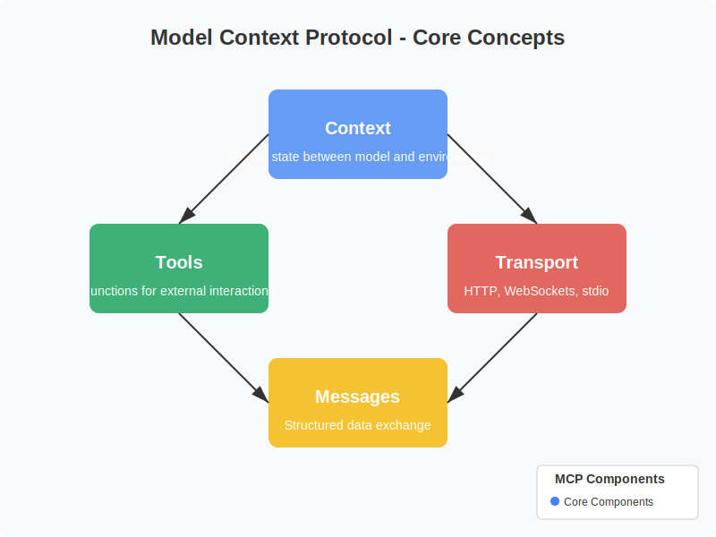
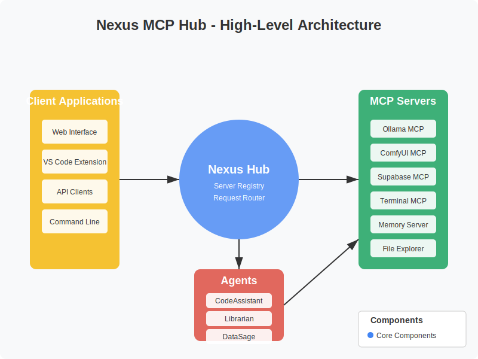
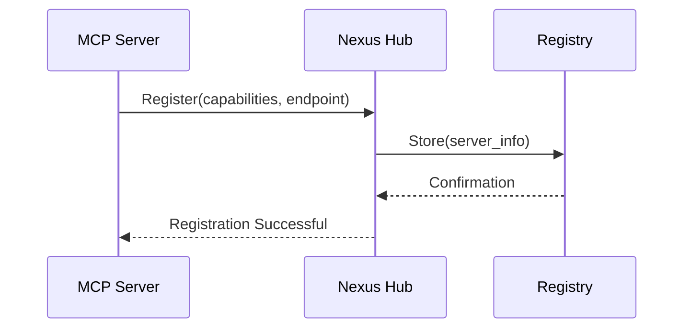
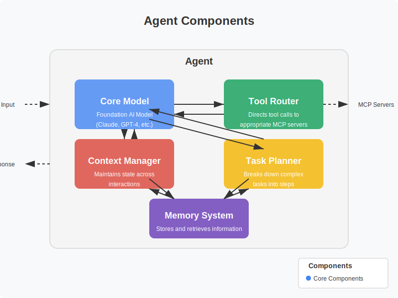
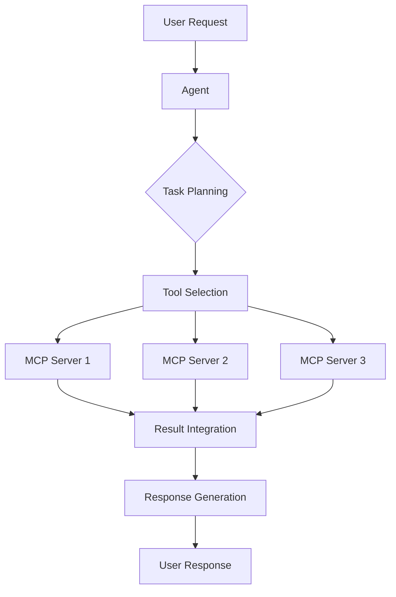
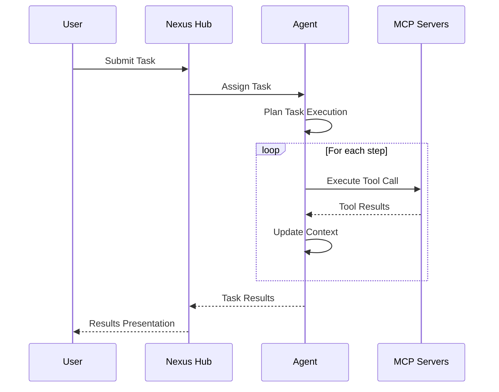
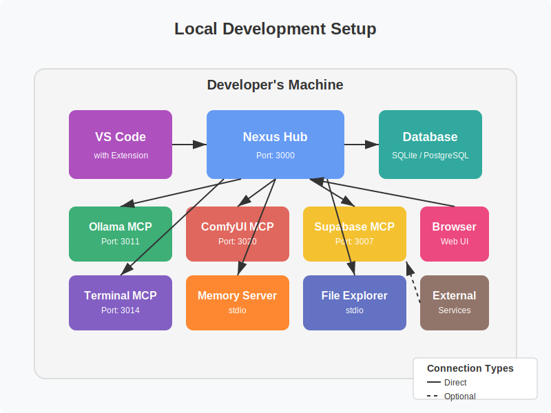
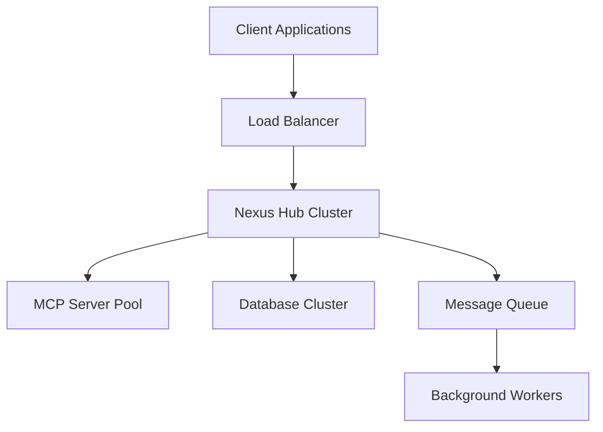
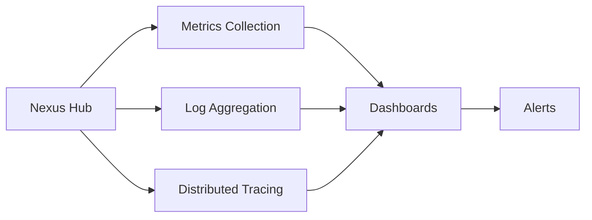

# Nexus MCP Hub: System Architecture Overview

## Introduction

The Nexus MCP Hub is a central management system for Model Context Protocol (MCP) servers, designed to facilitate the creation and operation of AI agents. This document provides a comprehensive overview of the system architecture, including the reference model, component interactions, and workflows.

## Reference Model

The Nexus MCP Hub is built on the official [Model Context Protocol](https://modelcontextprotocol.io) specification, which defines a standardized way for AI models to interact with tools, data sources, and other systems.

### MCP Core Concepts

The Model Context Protocol is based on several key concepts:

1. **Context**: The shared state between a model and its environment
2. **Tools**: Functions that models can call to interact with external systems
3. **Transport**: The communication layer between models and tools (HTTP, WebSockets, stdio)
4. **Messages**: Structured data exchanged between components

### Protocol Flow

The basic flow of the Model Context Protocol is:

1. Client sends a request to an MCP server
2. Server processes the request, potentially calling tools
3. Server returns a response to the client
4. Context is maintained across multiple interactions

## System Architecture

The Nexus MCP Hub extends the base MCP model with a hub-and-spoke architecture that enables centralized management of multiple MCP servers.

### High-Level Architecture

The system consists of the following major components:

1. **Nexus Hub**: The central management component
2. **MCP Servers**: Specialized servers providing specific capabilities
3. **Agents**: AI assistants that leverage multiple MCP servers
4. **Client Applications**: User interfaces for interacting with agents

### Component Interactions

The components interact through standardized interfaces:

1. **Client-Hub Interface**: REST API and WebSockets
2. **Hub-Server Interface**: Model Context Protocol
3. **Agent-Hub Interface**: Internal API
4. **Hub-Database Interface**: Data access layer

## MCP Server Ecosystem

The Nexus MCP Hub integrates with a diverse ecosystem of MCP servers, each providing specialized capabilities.

### Server Types

The current ecosystem includes:

1. **Ollama MCP (Port 3011)**: Language model inference
2. **ComfyUI MCP (Port 3020)**: Image generation and editing
3. **Supabase MCP (Port 3007)**: Database operations
4. **Terminal MCP (Port 3014)**: Command execution
5. **Memory Server**: Context management
6. **File Explorer**: File system operations
7. **Code Sandbox**: Code execution

### Server Registration

MCP servers are registered with the Nexus Hub through a discovery process:

## Agent Architecture

Agents in the Nexus MCP Hub are AI assistants that leverage multiple MCP servers to perform complex tasks.

### Agent Components

Each agent consists of:

1. **Core Model**: The foundation AI model (e.g., Claude, GPT-4)
2. **Tool Router**: Directs tool calls to appropriate MCP servers
3. **Context Manager**: Maintains state across interactions
4. **Task Planner**: Breaks down complex tasks into steps
5. **Memory System**: Stores and retrieves relevant information

### Agent Workflow

The typical workflow of an agent handling a user request:

## User Workflows

The Nexus MCP Hub supports various user workflows for different use cases.

### Agent Creation Workflow

The process of creating a new agent:

1. Define agent purpose and capabilities
2. Select required MCP servers
3. Configure agent parameters
4. Test agent performance
5. Deploy agent for use

### Task Execution Workflow

The process of executing a task with an agent:

## Deployment Architecture

The Nexus MCP Hub can be deployed in various configurations to suit different needs.

### Local Development Setup

For development and testing:

1. All components run on the developer's machine
2. Local database for persistence
3. Direct connections between components

### Production Deployment

For production environments:

## Security Model

The Nexus MCP Hub implements a comprehensive security model to protect data and ensure proper access control.

### Authentication and Authorization

The security model includes:

1. User authentication using JWT tokens
2. Role-based access control for MCP servers and agents
3. API rate limiting to prevent abuse
4. Audit logging of all operations

## Monitoring and Observability

The system includes comprehensive monitoring and observability features:

## Next Steps

This document provides a high-level overview of the Nexus MCP Hub architecture. For more detailed information, refer to the following documents:

- [MCP Server Integration Guide](../mcp-servers/integration-guide.md)
- [Agent Development Guide](../agents/development-guide.md)
- [API Reference](../api/reference.md)
- [Deployment Guide](../deployment/guide.md)
- [Security Best Practices](../security/best-practices.md)
