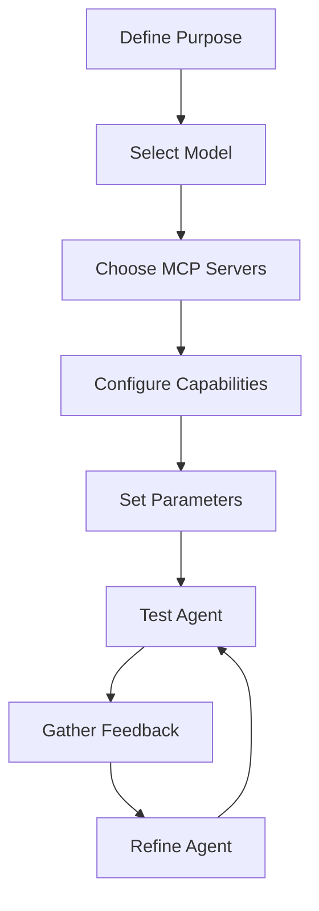

# Agent Development Guide

## Introduction

This guide explains how to create and configure AI agents in the Nexus MCP Hub. It covers agent architecture, capabilities, configuration, and best practices for designing effective agents.

## Understanding Agents

### What is an Agent?

In the Nexus MCP Hub, an agent is an AI assistant that:

1. Has a specific focus and capabilities
2. Can use multiple MCP servers
3. Maintains context and memory
4. Can execute complex workflows
5. Adapts to user needs

### Agent Architecture


Each agent consists of several key components:

1. **Core Model**: The foundation AI model (e.g., Claude, GPT-4)
2. **Tool Router**: Directs tool calls to appropriate MCP servers
3. **Context Manager**: Maintains state across interactions
4. **Task Planner**: Breaks down complex tasks into steps
5. **Memory System**: Stores and retrieves relevant information

### Agent Types

The Nexus MCP Hub supports various types of agents:

1. **Coding Agents**: Specialized in software development tasks
2. **Research Agents**: Focused on information retrieval and analysis
3. **Database Agents**: Experts in data management and analysis
4. **Creative Agents**: Specialized in content generation
5. **Cognitive Agents**: Focused on problem-solving and reasoning

## Creating an Agent

### Agent Configuration

Agents are defined using a configuration object:

```javascript
const agentConfig = {
  id: 'my-coding-agent',
  name: 'My Coding Agent',
  description: 'A specialized agent for software development tasks',
  type: 'coding',
  model: 'claude-3-sonnet',
  mcpServers: ['ollama-mcp', 'terminal-mcp'],
  capabilities: [
    'code-generation',
    'code-review',
    'code-explanation'
  ],
  parameters: {
    temperature: 0.7,
    maxTokens: 4096,
    topP: 0.95
  }
};
```

### Agent Creation API

The Nexus Hub provides an API for creating agents:

```javascript
// Example agent creation code
const axios = require('axios');

async function createAgent() {
  try {
    const response = await axios.post('http://localhost:3000/api/agents', agentConfig);
    console.log('Agent created successfully:', response.data);
  } catch (error) {
    console.error('Agent creation failed:', error.message);
  }
}

createAgent();
```

### Agent Creation UI

The Nexus Hub also provides a web interface for creating agents:

1. Navigate to the Agents page
2. Click "Create New Agent"
3. Fill in the agent details
4. Select MCP servers and capabilities
5. Configure parameters
6. Click "Create Agent"

## Agent Capabilities

### Core Capabilities

All agents have access to core capabilities:

1. **Conversation**: Basic conversation abilities
2. **Context Management**: Maintaining context across interactions
3. **Memory**: Storing and retrieving information
4. **Task Planning**: Breaking down complex tasks

### Specialized Capabilities

Specialized capabilities depend on the agent type and the MCP servers it uses:

#### Coding Capabilities

- **Code Generation**: Creating code based on descriptions
- **Code Review**: Analyzing code for issues
- **Code Explanation**: Explaining how code works
- **Code Refactoring**: Improving existing code
- **Code Debugging**: Finding and fixing bugs

#### Research Capabilities

- **Web Search**: Finding information online
- **Document Retrieval**: Accessing specific documents
- **Document Summarization**: Creating concise summaries
- **Knowledge Graph**: Building structured knowledge

#### Database Capabilities

- **Database Query**: Writing and optimizing queries
- **Data Analysis**: Analyzing data patterns
- **Schema Design**: Designing database schemas
- **Data Visualization**: Creating visual representations

#### Creative Capabilities

- **Creative Writing**: Generating stories, articles, etc.
- **Image Generation**: Creating images from descriptions
- **Content Ideation**: Generating creative ideas
- **Style Adaptation**: Adapting to different styles

#### Cognitive Capabilities

- **Problem Solving**: Finding solutions to complex problems
- **Decision Making**: Evaluating options and making recommendations
- **Reasoning**: Logical and critical thinking
- **Learning**: Adapting based on feedback

## Configuring Agent Behavior

### Model Parameters

Model parameters control the behavior of the agent's core model:

- **Temperature**: Controls randomness (0.0-1.0)
- **Max Tokens**: Maximum response length
- **Top P**: Controls diversity via nucleus sampling
- **Frequency Penalty**: Reduces repetition
- **Presence Penalty**: Encourages new topics

### Context Window

The context window determines how much information the agent can consider:

- **Window Size**: Number of tokens in the context
- **Context Management**: How context is maintained
- **Memory Integration**: How memory is used

### Tool Selection

Configure which tools the agent can use:

- **Tool Whitelist**: Specific tools the agent can use
- **Tool Blacklist**: Tools the agent cannot use
- **Tool Priorities**: Which tools to prefer

## Agent Development Workflow

### Development Process

The typical workflow for developing an agent:



1. Define the agent's purpose and target use cases
2. Select an appropriate core model
3. Choose MCP servers based on required capabilities
4. Configure the agent's capabilities
5. Set model parameters
6. Test the agent with sample tasks
7. Gather feedback and metrics
8. Refine the agent based on feedback

### Testing Methodology

Effective agent testing includes:

1. **Unit Testing**: Testing specific capabilities
2. **Integration Testing**: Testing with MCP servers
3. **Scenario Testing**: Testing with realistic scenarios
4. **Benchmark Testing**: Measuring performance
5. **User Testing**: Getting feedback from users

## Agent Examples

### CodeAssistant

Advanced coding agent for software development tasks.

```javascript
const codeAssistantConfig = {
  id: 'code-assistant',
  name: 'CodeAssistant',
  description: 'Advanced coding agent for software development tasks',
  type: 'coding',
  model: 'claude-3-sonnet',
  mcpServers: ['ollama-mcp'],
  capabilities: [
    'code-generation',
    'code-review',
    'code-explanation',
    'code-refactoring',
    'code-debugging'
  ],
  parameters: {
    temperature: 0.7,
    maxTokens: 8192,
    topP: 0.95
  }
};
```

### Librarian

Research agent for information retrieval and analysis.

```javascript
const librarianConfig = {
  id: 'librarian',
  name: 'Librarian',
  description: 'Research agent for information retrieval and analysis',
  type: 'research',
  model: 'claude-3-opus',
  mcpServers: ['supabase-mcp', 'terminal-mcp'],
  capabilities: [
    'web-search',
    'document-retrieval',
    'document-summarization',
    'knowledge-graph'
  ],
  parameters: {
    temperature: 0.5,
    maxTokens: 12000,
    topP: 0.9
  }
};
```

### Muse

Creative agent for content generation and ideation.

```javascript
const museConfig = {
  id: 'muse',
  name: 'Muse',
  description: 'Creative agent for content generation and ideation',
  type: 'creative',
  model: 'claude-3-opus',
  mcpServers: ['comfyui-mcp', 'ollama-mcp'],
  capabilities: [
    'creative-writing',
    'image-generation'
  ],
  parameters: {
    temperature: 0.9,
    maxTokens: 8192,
    topP: 0.98
  }
};
```

## Agent Evaluation

### Performance Metrics

Evaluate agent performance using appropriate metrics:

#### Coding Metrics

- **HumanEval**: Code generation from function descriptions
- **CodeXGLUE**: Collection of code understanding tasks
- **MBPP**: Basic programming problems

#### Knowledge Metrics

- **MMLU**: Multi-task language understanding
- **TruthfulQA**: Truthfulness in question answering
- **ARC**: Grade-school science reasoning

#### Creative Metrics

- **Creative Writing**: Quality and originality of writing
- **Idea Generation**: Usefulness and novelty of ideas

### Benchmark Tools

The Nexus Hub provides tools for benchmarking agents:

1. **Benchmark Runner**: Executes benchmark tests
2. **Metric Calculator**: Computes performance metrics
3. **Comparison Tool**: Compares agents against baselines

## Best Practices

### Agent Design

1. **Focus on Specific Use Cases**: Design agents for specific tasks rather than general-purpose use
2. **Leverage Multiple MCP Servers**: Combine capabilities from different servers
3. **Balance Parameters**: Adjust temperature and other parameters based on the task
4. **Implement Fallbacks**: Handle cases where tools fail
5. **Use Structured Output**: Define clear output formats

### Prompt Engineering

1. **Clear Instructions**: Provide clear and specific instructions
2. **Few-Shot Examples**: Include examples of desired behavior
3. **Task Decomposition**: Break complex tasks into steps
4. **Contextual Information**: Provide relevant context
5. **Output Format Specification**: Define expected output format

### Security Considerations

1. **Input Validation**: Validate all user inputs
2. **Tool Restrictions**: Limit tool access based on needs
3. **Output Filtering**: Filter sensitive information
4. **Rate Limiting**: Prevent abuse
5. **Audit Logging**: Log all agent actions

## Troubleshooting

### Common Issues

1. **Hallucinations**: Agent generates incorrect information
2. **Tool Selection**: Agent uses wrong tools
3. **Context Limitations**: Agent forgets important information
4. **Parameter Tuning**: Agent behavior doesn't match expectations
5. **Performance Issues**: Agent is too slow

### Solutions

1. **Hallucinations**: Provide more context, use lower temperature
2. **Tool Selection**: Improve tool descriptions, provide examples
3. **Context Limitations**: Implement better memory management
4. **Parameter Tuning**: Experiment with different parameters
5. **Performance Issues**: Optimize tool calls, use more efficient models

## Next Steps

After developing your agent:

1. Deploy it for production use
2. Monitor its performance
3. Gather user feedback
4. Iterate and improve
5. Share your agent with the community

For more information, refer to the following resources:

- [System Architecture Overview](../architecture/system-overview.md)
- [MCP Server Integration Guide](../mcp-servers/integration-guide.md)
- [API Reference](../api/reference.md)
- [Deployment Guide](../deployment/guide.md)
