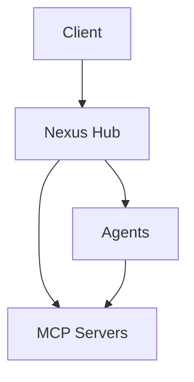

# Documentation Images

This directory contains images used in the Nexus MCP Hub documentation.

## Required Images

The following images are referenced in the documentation and should be created:

1. **mcp-core-concepts.png**: Diagram showing the core concepts of the Model Context Protocol
2. **high-level-architecture.png**: Diagram showing the high-level architecture of the Nexus MCP Hub
3. **component-interactions.png**: Diagram showing the interactions between components
4. **mcp-server-types.png**: Diagram showing the different types of MCP servers
5. **agent-components.png**: Diagram showing the components of an agent
6. **agent-creation-workflow.png**: Diagram showing the workflow for creating an agent
7. **local-development-setup.png**: Diagram showing the local development setup
8. **auth-flow.png**: Diagram showing the authentication flow
9. **agent-architecture.png**: Diagram showing the architecture of an agent
10. **software-development-workflow.png**: Diagram showing the software development workflow

## Image Guidelines

When creating these images, please follow these guidelines:

1. **Consistency**: Use a consistent style and color scheme
2. **Clarity**: Make sure the images are clear and easy to understand
3. **Accessibility**: Use high contrast and avoid relying solely on color
4. **Resolution**: Use a resolution of at least 1200x800 pixels
5. **Format**: Save images in PNG format
6. **File Size**: Keep file sizes under 500KB

## Recommended Tools

The following tools are recommended for creating documentation images:

1. **Draw.io**: Free online diagramming tool
2. **Figma**: Design tool with collaboration features
3. **Lucidchart**: Online diagramming tool with extensive templates
4. **Mermaid**: Markdown-based diagramming tool (used for some diagrams in the docs)

## Mermaid Diagrams

Some diagrams in the documentation are created using Mermaid. These are rendered directly from the markdown and don't require separate image files.

Example:

## Next Steps

1. Create the required images
2. Place them in this directory
3. Update the documentation to reference the correct image paths
4. Verify that all images display correctly
