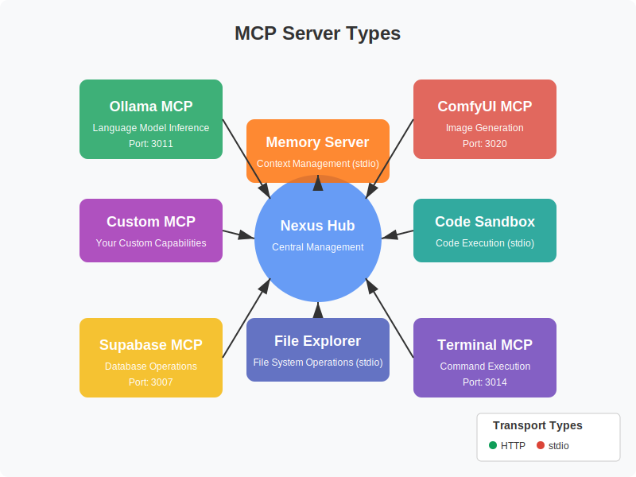

# MCP Server Types

## Introduction

The Nexus MCP Hub integrates with various types of Model Context Protocol (MCP) servers, each providing specific capabilities to agents. This document describes the different types of MCP servers, their capabilities, and how they can be used in the Nexus ecosystem.



## Language Model Servers

### Ollama MCP

Ollama MCP provides access to open-source language models through Ollama.

#### Overview

- **Port**: 3011
- **Transport**: HTTP
- **Primary Capabilities**: Language model inference, code generation
- **Models**: Llama 3 (70B, 8B), Mistral, Phi-3, Gemma, Stable Code

#### Key Features

- Local execution of large language models
- Support for multiple model architectures
- Streaming responses
- Context management
- Parameter customization

#### Use Cases

- Code generation and explanation
- Text generation and summarization
- Question answering
- Translation
- Creative writing

#### Configuration

```json
{
  "id": "ollama-mcp",
  "name": "Ollama MCP",
  "description": "Language model inference through Ollama",
  "url": "http://localhost",
  "port": 3011,
  "transport": "http",
  "capabilities": ["text-generation", "code-generation"],
  "models": [
    {
      "id": "llama3:8b",
      "name": "Llama 3 8B",
      "contextLength": 8192
    },
    {
      "id": "llama3:70b",
      "name": "Llama 3 70B",
      "contextLength": 8192
    },
    {
      "id": "mistral:7b",
      "name": "Mistral 7B",
      "contextLength": 8192
    }
  ]
}
```

#### Example Request

```http
POST /v1/generate
Content-Type: application/json

{
  "model": "llama3:8b",
  "prompt": "Write a function to calculate the Fibonacci sequence",
  "stream": false,
  "temperature": 0.7,
  "max_tokens": 500
}
```

#### Example Response

```json
{
  "id": "gen_123456",
  "model": "llama3:8b",
  "response": "```javascript\nfunction fibonacci(n) {\n  if (n <= 0) return [];\n  if (n === 1) return [0];\n  if (n === 2) return [0, 1];\n  \n  const result = [0, 1];\n  for (let i = 2; i < n; i++) {\n    result.push(result[i-1] + result[i-2]);\n  }\n  \n  return result;\n}\n```\n\nThis function calculates the Fibonacci sequence up to n terms. It handles edge cases (n <= 0, n = 1, n = 2) and then uses a loop to calculate the remaining terms."
}
```

## Image Generation Servers

### ComfyUI MCP

ComfyUI MCP enables image generation and editing using ComfyUI workflows.

#### Overview

- **Port**: 3020
- **Transport**: HTTP
- **Primary Capabilities**: Image generation, image editing
- **Models**: Stable Diffusion XL, Stable Diffusion 1.5, ControlNet, IP-Adapter

#### Key Features

- Text-to-image generation
- Image-to-image transformation
- Style transfer
- Inpainting and outpainting
- Advanced workflow customization

#### Use Cases

- Creating illustrations and artwork
- Generating product images
- Visualizing concepts
- Editing and enhancing photos
- Creating variations of existing images

#### Configuration

```json
{
  "id": "comfyui-mcp",
  "name": "ComfyUI MCP",
  "description": "Image generation and editing using ComfyUI workflows",
  "url": "http://localhost",
  "port": 3020,
  "transport": "http",
  "capabilities": ["image-generation", "image-editing"],
  "models": [
    {
      "id": "sdxl",
      "name": "Stable Diffusion XL",
      "resolution": "1024x1024"
    },
    {
      "id": "sd15",
      "name": "Stable Diffusion 1.5",
      "resolution": "512x512"
    }
  ]
}
```

#### Example Request

```http
POST /v1/generate
Content-Type: application/json

{
  "prompt": "A beautiful landscape with mountains and a lake",
  "negative_prompt": "blurry, low quality",
  "model": "sdxl",
  "width": 1024,
  "height": 1024,
  "steps": 30,
  "cfg_scale": 7.0
}
```

#### Example Response

```json
{
  "id": "img_123456",
  "model": "sdxl",
  "image_url": "http://localhost:3020/images/img_123456.png",
  "parameters": {
    "prompt": "A beautiful landscape with mountains and a lake",
    "negative_prompt": "blurry, low quality",
    "width": 1024,
    "height": 1024,
    "steps": 30,
    "cfg_scale": 7.0
  }
}
```

## Database Servers

### Supabase MCP

Supabase MCP provides database access and operations through Supabase.

#### Overview

- **Port**: 3007
- **Transport**: HTTP
- **Primary Capabilities**: Database operations, storage
- **Features**: PostgreSQL database, row-level security, real-time subscriptions

#### Key Features

- SQL query execution
- Data manipulation (insert, update, delete)
- Schema management
- File storage
- Real-time data subscriptions

#### Use Cases

- Storing and retrieving structured data
- Managing user data
- Building knowledge bases
- Implementing persistent memory for agents
- Managing file attachments

#### Configuration

```json
{
  "id": "supabase-mcp",
  "name": "Supabase MCP",
  "description": "Database access and operations through Supabase",
  "url": "http://localhost",
  "port": 3007,
  "transport": "http",
  "capabilities": ["database-query", "data-storage"],
  "database": {
    "type": "postgres",
    "version": "14"
  }
}
```

#### Example Request

```http
POST /v1/query
Content-Type: application/json

{
  "query": "SELECT * FROM users WHERE email = $1",
  "params": ["user@example.com"]
}
```

#### Example Response

```json
{
  "id": "query_123456",
  "data": [
    {
      "id": 1,
      "name": "John Doe",
      "email": "user@example.com",
      "created_at": "2023-01-01T00:00:00Z"
    }
  ],
  "count": 1,
  "execution_time": 5
}
```

## System Operation Servers

### Terminal MCP

Terminal MCP allows execution of terminal commands in a controlled environment.

#### Overview

- **Port**: 3014
- **Transport**: HTTP
- **Primary Capabilities**: Command execution
- **Features**: Command whitelisting, working directory management, timeout control

#### Key Features

- Execute shell commands
- Run scripts
- Access system information
- Manage files and directories
- Install and configure software

#### Use Cases

- System administration tasks
- File management
- Running development tools
- Executing data processing scripts
- Automating workflows

#### Configuration

```json
{
  "id": "terminal-mcp",
  "name": "Terminal MCP",
  "description": "Command execution in a controlled environment",
  "url": "http://localhost",
  "port": 3014,
  "transport": "http",
  "capabilities": ["command-execution", "file-management"],
  "security": {
    "allowedCommands": ["ls", "pwd", "echo", "cat", "grep", "find"],
    "workingDirRestriction": true,
    "defaultTimeout": 5000
  }
}
```

#### Example Request

```http
POST /v1/execute
Content-Type: application/json

{
  "command": "ls -la",
  "workingDir": "/home/user/projects",
  "timeout": 5000
}
```

#### Example Response

```json
{
  "id": "exec_123456",
  "command": "ls -la",
  "status": 0,
  "stdout": "total 24\ndrwxr-xr-x  5 user user 4096 Jun 18 14:30 .\ndrwxr-xr-x 20 user user 4096 Jun 18 14:00 ..\ndrwxr-xr-x  8 user user 4096 Jun 18 14:30 .git\n-rw-r--r--  1 user user  512 Jun 18 14:30 README.md\ndrwxr-xr-x  3 user user 4096 Jun 18 14:30 src\ndrwxr-xr-x  2 user user 4096 Jun 18 14:30 tests\n",
  "stderr": "",
  "execution_time": 15
}
```

## Context Management Servers

### Memory Server

Memory Server manages agent memory and context using stdio transport.

#### Overview

- **Transport**: stdio
- **Primary Capabilities**: Context management
- **Features**: Memory storage and retrieval, context maintenance

#### Key Features

- Store and retrieve memories
- Maintain conversation history
- Manage user preferences
- Implement forgetting mechanisms
- Support for different memory types

#### Use Cases

- Maintaining conversation context
- Storing user preferences
- Implementing long-term memory
- Managing agent state
- Enabling personalization

#### Configuration

```json
{
  "id": "memory-server",
  "name": "Memory Server",
  "description": "Context management for agents",
  "transport": "stdio",
  "capabilities": ["memory-storage", "context-management"],
  "memory": {
    "types": ["conversation", "semantic", "episodic"],
    "retention": {
      "conversation": "session",
      "semantic": "permanent",
      "episodic": "30d"
    }
  }
}
```

#### Example Request

```json
{
  "id": "mem_123456",
  "method": "memory.store",
  "params": {
    "type": "conversation",
    "content": "User asked about Fibonacci sequence",
    "metadata": {
      "timestamp": "2023-06-18T14:30:00Z",
      "importance": 0.7
    }
  }
}
```

#### Example Response

```json
{
  "id": "mem_123456",
  "result": {
    "memory_id": "conv_789012",
    "status": "stored"
  }
}
```

## File System Servers

### File Explorer

File Explorer provides file system access and operations using stdio transport.

#### Overview

- **Transport**: stdio
- **Primary Capabilities**: File system operations
- **Features**: File reading and writing, directory management

#### Key Features

- Read and write files
- List directory contents
- Create and delete files and directories
- Search for files
- Get file metadata

#### Use Cases

- Accessing documentation
- Managing configuration files
- Processing data files
- Working with code repositories
- Organizing project files

#### Configuration

```json
{
  "id": "file-explorer",
  "name": "File Explorer",
  "description": "File system access and operations",
  "transport": "stdio",
  "capabilities": ["file-read", "file-write", "directory-management"],
  "security": {
    "allowedPaths": ["/home/user/projects", "/tmp"],
    "maxFileSize": 10485760
  }
}
```

#### Example Request

```json
{
  "id": "file_123456",
  "method": "file.read",
  "params": {
    "path": "/home/user/projects/README.md"
  }
}
```

#### Example Response

```json
{
  "id": "file_123456",
  "result": {
    "content": "# Project README\n\nThis is a sample project.",
    "metadata": {
      "size": 42,
      "modified": "2023-06-18T14:30:00Z",
      "mime": "text/markdown"
    }
  }
}
```

## Code Execution Servers

### Code Sandbox

Code Sandbox enables code execution in a sandboxed environment using stdio transport.

#### Overview

- **Transport**: stdio
- **Primary Capabilities**: Code execution
- **Features**: Multi-language support, security isolation, resource limits

#### Key Features

- Execute code snippets
- Support multiple programming languages
- Provide execution results
- Capture stdout and stderr
- Implement security isolation

#### Use Cases

- Testing code snippets
- Evaluating algorithm performance
- Demonstrating code examples
- Debugging issues
- Teaching programming concepts

#### Configuration

```json
{
  "id": "code-sandbox",
  "name": "Code Sandbox",
  "description": "Code execution in a sandboxed environment",
  "transport": "stdio",
  "capabilities": ["code-execution"],
  "languages": ["javascript", "python", "ruby", "go", "rust"],
  "security": {
    "timeoutMs": 5000,
    "memoryLimitMb": 128,
    "networkAccess": false
  }
}
```

#### Example Request

```json
{
  "id": "code_123456",
  "method": "code.execute",
  "params": {
    "language": "python",
    "code": "def fibonacci(n):\n    if n <= 0:\n        return []\n    elif n == 1:\n        return [0]\n    elif n == 2:\n        return [0, 1]\n    else:\n        fib = [0, 1]\n        for i in range(2, n):\n            fib.append(fib[i-1] + fib[i-2])\n        return fib\n\nprint(fibonacci(10))"
  }
}
```

#### Example Response

```json
{
  "id": "code_123456",
  "result": {
    "stdout": "[0, 1, 1, 2, 3, 5, 8, 13, 21, 34]\n",
    "stderr": "",
    "exitCode": 0,
    "executionTime": 12
  }
}
```

## Integrating New MCP Servers

To integrate a new MCP server with the Nexus MCP Hub:

1. Implement the MCP specification in your server
2. Configure the server with a unique identifier and capabilities
3. Register the server with the Nexus Hub
4. Test the integration with agents

For detailed instructions, see the [MCP Server Integration Guide](integration-guide.md).

## Best Practices

When working with MCP servers:

1. **Security**: Implement proper authentication and authorization
2. **Resource Management**: Set appropriate resource limits
3. **Error Handling**: Implement robust error handling
4. **Monitoring**: Monitor server health and performance
5. **Documentation**: Document server capabilities and usage

## Next Steps

After understanding the different types of MCP servers:

1. [Integrate MCP servers](integration-guide.md) with the Nexus Hub
2. [Create agents](../agents/development-guide.md) that leverage these servers
3. [Configure workflows](../workflows/overview.md) that combine multiple servers
4. [Secure your deployment](../security/best-practices.md)
