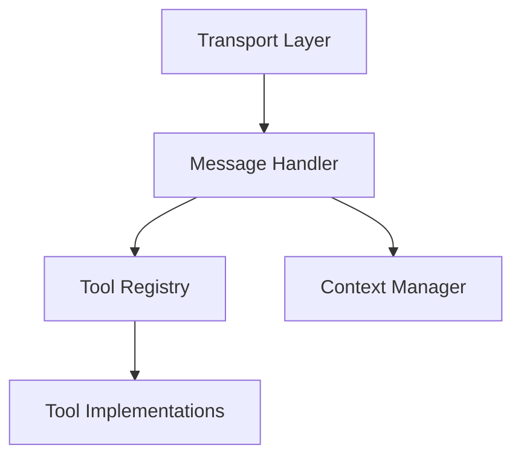

# MCP Server Integration Guide

## Introduction

This guide explains how to integrate new Model Context Protocol (MCP) servers with the Nexus MCP Hub. It covers protocol implementation, server registration, authentication, and testing procedures.

## Understanding the Model Context Protocol

The Model Context Protocol (MCP) is a standardized way for AI models to interact with tools, data sources, and other systems. Before implementing an MCP server, it's essential to understand the core concepts of the protocol.

### Key Concepts

1. **Context**: The shared state between a model and its environment
2. **Tools**: Functions that models can call to interact with external systems
3. **Transport**: The communication layer between models and tools
4. **Messages**: Structured data exchanged between components

### Protocol Specification

The official MCP specification is available at [modelcontextprotocol.io](https://modelcontextprotocol.io). The specification defines:

- Message formats and schemas
- Transport mechanisms
- Tool calling conventions
- Error handling
- Context management

## MCP Server Implementation

### Server Architecture

An MCP server typically consists of the following components:



1. **Transport Layer**: Handles communication (HTTP, WebSockets, stdio)
2. **Message Handler**: Processes incoming messages and generates responses
3. **Tool Registry**: Manages available tools and their specifications
4. **Context Manager**: Maintains context across multiple interactions
5. **Tool Implementations**: The actual functionality provided by the server

### Supported Transport Types

The Nexus MCP Hub supports three transport types:

#### HTTP Transport

HTTP transport is suitable for stateless interactions and is the most common transport type.

```javascript
// Example HTTP server setup
const express = require('express');
const app = express();
app.use(express.json());

app.post('/v1/generate', async (req, res) => {
  try {
    const { prompt, model, tools } = req.body;
    const response = await processRequest(prompt, model, tools);
    res.json(response);
  } catch (error) {
    res.status(500).json({ error: error.message });
  }
});

app.listen(3000, () => {
  console.log('MCP server listening on port 3000');
});
```

#### WebSocket Transport

WebSocket transport is ideal for streaming responses and maintaining long-lived connections.

```javascript
// Example WebSocket server setup
const WebSocket = require('ws');
const wss = new WebSocket.Server({ port: 3000 });

wss.on('connection', (ws) => {
  ws.on('message', async (message) => {
    try {
      const { prompt, model, tools } = JSON.parse(message);
      const response = await processRequest(prompt, model, tools);
      ws.send(JSON.stringify(response));
    } catch (error) {
      ws.send(JSON.stringify({ error: error.message }));
    }
  });
});
```

#### stdio Transport

stdio transport is used for local processes and is typically implemented as a Node.js script that reads from stdin and writes to stdout.

```javascript
// Example stdio transport
const readline = require('readline');
const rl = readline.createInterface({
  input: process.stdin,
  output: process.stdout,
  terminal: false
});

rl.on('line', async (line) => {
  try {
    const { prompt, model, tools } = JSON.parse(line);
    const response = await processRequest(prompt, model, tools);
    console.log(JSON.stringify(response));
  } catch (error) {
    console.log(JSON.stringify({ error: error.message }));
  }
});
```

### Message Format

MCP messages follow a standardized JSON format:

#### Request Format

```json
{
  "id": "req_123456",
  "type": "request",
  "model": "model_name",
  "prompt": "User query or instruction",
  "context": {
    "conversation": [
      {"role": "user", "content": "Previous message"},
      {"role": "assistant", "content": "Previous response"}
    ]
  },
  "tools": [
    {
      "name": "tool_name",
      "description": "Tool description",
      "parameters": {
        "type": "object",
        "properties": {
          "param1": {
            "type": "string",
            "description": "Parameter description"
          }
        },
        "required": ["param1"]
      }
    }
  ]
}
```

#### Response Format

```json
{
  "id": "res_123456",
  "type": "response",
  "request_id": "req_123456",
  "content": "Response content",
  "tool_calls": [
    {
      "name": "tool_name",
      "parameters": {
        "param1": "value1"
      }
    }
  ]
}
```

### Tool Implementation

Tools are the core functionality provided by an MCP server. Each tool should:

1. Have a unique name
2. Include a clear description
3. Define its parameters using JSON Schema
4. Implement the actual functionality

```javascript
// Example tool implementation
const tools = {
  search_web: {
    name: "search_web",
    description: "Search the web for information",
    parameters: {
      type: "object",
      properties: {
        query: {
          type: "string",
          description: "The search query"
        }
      },
      required: ["query"]
    },
    execute: async (params) => {
      const { query } = params;
      // Implement web search functionality
      const results = await performWebSearch(query);
      return results;
    }
  }
};
```

## Registering with Nexus MCP Hub

### Registration Process

To register an MCP server with the Nexus MCP Hub:

1. Implement the MCP server following the guidelines above
2. Configure the server with a unique identifier and capabilities
3. Start the server on a designated port
4. Register the server with the Nexus Hub

### Registration API

The Nexus Hub provides an API endpoint for server registration:

```javascript
// Example registration code
const axios = require('axios');

async function registerServer() {
  try {
    const response = await axios.post('http://localhost:3000/api/mcp-servers/register', {
      id: 'my-mcp-server',
      name: 'My MCP Server',
      description: 'Custom MCP server implementation',
      transport: 'http',
      url: 'http://localhost',
      port: 3001,
      capabilities: ['web_search', 'data_analysis'],
      tools: [
        {
          name: 'search_web',
          description: 'Search the web for information',
          parameters: {
            type: 'object',
            properties: {
              query: {
                type: 'string',
                description: 'The search query'
              }
            },
            required: ['query']
          }
        }
      ]
    });
    
    console.log('Server registered successfully:', response.data);
  } catch (error) {
    console.error('Registration failed:', error.message);
  }
}

registerServer();
```

### Auto-Discovery

The Nexus Hub also supports auto-discovery of MCP servers on the local network:

1. The Nexus Hub broadcasts discovery requests on the network
2. MCP servers respond with their capabilities and connection details
3. The Nexus Hub registers the discovered servers

## Authentication and Security

### Authentication Methods

MCP servers can implement various authentication methods:

1. **API Key**: Simple key-based authentication
2. **JWT**: Token-based authentication with claims
3. **OAuth**: For third-party authentication
4. **None**: For local development and testing

### Implementing API Key Authentication

```javascript
// Example API key authentication middleware
function authenticateApiKey(req, res, next) {
  const apiKey = req.headers['x-api-key'];
  
  if (!apiKey || !isValidApiKey(apiKey)) {
    return res.status(401).json({ error: 'Invalid API key' });
  }
  
  next();
}

app.use(authenticateApiKey);
```

### Implementing JWT Authentication

```javascript
// Example JWT authentication middleware
const jwt = require('jsonwebtoken');

function authenticateJwt(req, res, next) {
  const token = req.headers.authorization?.split(' ')[1];
  
  if (!token) {
    return res.status(401).json({ error: 'No token provided' });
  }
  
  try {
    const decoded = jwt.verify(token, process.env.JWT_SECRET);
    req.user = decoded;
    next();
  } catch (error) {
    return res.status(401).json({ error: 'Invalid token' });
  }
}

app.use(authenticateJwt);
```

### Security Best Practices

1. Use HTTPS for all HTTP transport
2. Implement rate limiting to prevent abuse
3. Validate all input parameters
4. Implement proper error handling
5. Use secure coding practices
6. Regularly update dependencies

## Testing and Validation

### Testing Tools

The Nexus Hub provides tools for testing MCP servers:

1. **MCP Client**: A command-line tool for sending requests to MCP servers
2. **MCP Server Validator**: A tool for validating MCP server implementations
3. **MCP Server Benchmark**: A tool for benchmarking MCP server performance

### Validation Process

To validate an MCP server:

1. Run the MCP Server Validator against your server
2. Fix any issues reported by the validator
3. Test with sample requests
4. Benchmark performance

### Sample Test Script

```javascript
// Example test script
const axios = require('axios');

async function testMcpServer() {
  try {
    const response = await axios.post('http://localhost:3001/v1/generate', {
      prompt: 'Search for information about climate change',
      model: 'test-model',
      tools: [
        {
          name: 'search_web',
          description: 'Search the web for information',
          parameters: {
            type: 'object',
            properties: {
              query: {
                type: 'string',
                description: 'The search query'
              }
            },
            required: ['query']
          }
        }
      ]
    });
    
    console.log('Test successful:', response.data);
  } catch (error) {
    console.error('Test failed:', error.message);
  }
}

testMcpServer();
```

## Examples

### Example: Ollama MCP Server

The Ollama MCP Server provides access to open-source language models through Ollama.

```javascript
// Simplified Ollama MCP Server implementation
const express = require('express');
const axios = require('axios');
const app = express();
app.use(express.json());

app.post('/v1/generate', async (req, res) => {
  try {
    const { prompt, model = 'llama3:8b', stream = false } = req.body;
    
    const response = await axios.post('http://localhost:11434/api/generate', {
      model,
      prompt,
      stream
    });
    
    res.json({
      id: `res_${Date.now()}`,
      type: 'response',
      request_id: req.body.id || `req_${Date.now()}`,
      content: response.data.response
    });
  } catch (error) {
    res.status(500).json({ error: error.message });
  }
});

app.listen(3011, () => {
  console.log('Ollama MCP server listening on port 3011');
});
```

### Example: Terminal MCP Server

The Terminal MCP Server allows execution of terminal commands in a controlled environment.

```javascript
// Simplified Terminal MCP Server implementation
const express = require('express');
const { exec } = require('child_process');
const app = express();
app.use(express.json());

// Whitelist of allowed commands
const allowedCommands = ['ls', 'pwd', 'echo', 'cat'];

app.post('/v1/execute', async (req, res) => {
  try {
    const { command, workingDir, timeout = 5000 } = req.body;
    
    // Extract the base command
    const baseCommand = command.split(' ')[0];
    
    // Check if the command is allowed
    if (!allowedCommands.includes(baseCommand)) {
      return res.status(403).json({ error: 'Command not allowed' });
    }
    
    // Execute the command
    exec(command, { cwd: workingDir, timeout }, (error, stdout, stderr) => {
      if (error) {
        return res.status(500).json({ error: error.message });
      }
      
      res.json({
        id: `res_${Date.now()}`,
        type: 'response',
        request_id: req.body.id || `req_${Date.now()}`,
        output: stdout,
        error: stderr
      });
    });
  } catch (error) {
    res.status(500).json({ error: error.message });
  }
});

app.listen(3014, () => {
  console.log('Terminal MCP server listening on port 3014');
});
```

## Troubleshooting

### Common Issues

1. **Connection Refused**: Check if the server is running and the port is correct
2. **Authentication Failed**: Verify API keys or tokens
3. **Invalid Message Format**: Ensure request format follows the MCP specification
4. **Tool Not Found**: Check if the requested tool is registered
5. **Timeout**: Increase timeout settings for long-running operations

### Debugging Tips

1. Enable verbose logging in your MCP server
2. Use tools like Postman or curl to test API endpoints
3. Check server logs for error messages
4. Validate JSON schemas before sending requests
5. Test with simplified requests to isolate issues

## Next Steps

After successfully integrating your MCP server with the Nexus Hub:

1. Create agents that utilize your server's capabilities
2. Document your server's tools and parameters
3. Develop example workflows
4. Monitor performance and usage
5. Gather feedback and iterate

For more information, refer to the following resources:

- [System Architecture Overview](../architecture/system-overview.md)
- [Agent Development Guide](../agents/development-guide.md)
- [API Reference](../api/reference.md)
