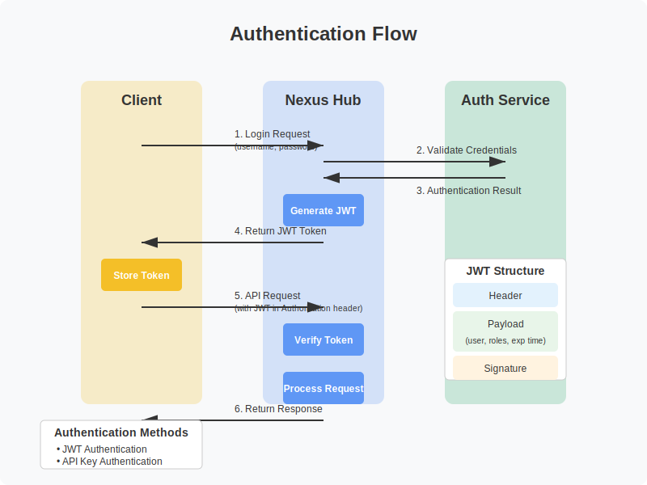

# Security Best Practices

## Introduction

This document outlines security best practices for deploying and operating the Nexus MCP Hub. Following these guidelines will help protect your system from unauthorized access, data breaches, and other security threats.

## Authentication and Authorization



### Authentication Methods

The Nexus MCP Hub supports multiple authentication methods:

1. **JWT Authentication**: Token-based authentication with claims
2. **API Key Authentication**: Simple key-based authentication
3. **Basic Authentication**: Username and password authentication (not recommended for production)

For production deployments, JWT authentication is recommended.

### JWT Configuration

When using JWT authentication:

1. Use a strong, random secret key
2. Set a reasonable expiration time (e.g., 1 hour)
3. Include only necessary claims in the token
4. Use HTTPS to protect token transmission

Example configuration:

```json
{
  "auth": {
    "jwt": {
      "secret": "your-strong-random-secret",
      "expiresIn": 3600,
      "algorithm": "HS256"
    }
  }
}
```

### API Key Configuration

When using API key authentication:

1. Generate long, random API keys
2. Assign specific permissions to each API key
3. Rotate API keys regularly
4. Revoke compromised API keys immediately

Example configuration:

```json
{
  "auth": {
    "apiKey": {
      "enabled": true,
      "header": "X-API-Key"
    }
  }
}
```

### Role-Based Access Control (RBAC)

Implement RBAC to restrict access based on user roles:

1. Define roles with specific permissions
2. Assign users to appropriate roles
3. Enforce permission checks for all operations

Example roles:

- **Admin**: Full access to all resources
- **Operator**: Manage servers and agents, but cannot modify users
- **User**: Use agents and view resources, but cannot modify them
- **Observer**: View resources only

Example configuration:

```json
{
  "auth": {
    "rbac": {
      "enabled": true,
      "roles": [
        {
          "name": "admin",
          "permissions": ["*:*"]
        },
        {
          "name": "operator",
          "permissions": ["read:*", "write:servers", "write:agents"]
        },
        {
          "name": "user",
          "permissions": ["read:*", "execute:agents"]
        },
        {
          "name": "observer",
          "permissions": ["read:*"]
        }
      ]
    }
  }
}
```

## Network Security

### TLS/SSL

Always use TLS/SSL for production deployments:

1. Obtain a valid certificate from a trusted CA
2. Configure the server to use TLS
3. Redirect HTTP to HTTPS
4. Use modern TLS protocols (TLS 1.2 or higher)
5. Configure secure cipher suites

Example configuration:

```json
{
  "server": {
    "tls": {
      "enabled": true,
      "cert": "/path/to/cert.pem",
      "key": "/path/to/key.pem",
      "minVersion": "TLS1.2",
      "cipherPreference": "modern"
    }
  }
}
```

### Firewall Configuration

Restrict network access to the Nexus MCP Hub:

1. Allow only necessary ports (e.g., 3000 for API, 3001 for admin)
2. Restrict access to trusted IP addresses
3. Use a firewall to block unauthorized access

Example iptables rules:

```bash
# Allow API access
iptables -A INPUT -p tcp --dport 3000 -j ACCEPT

# Allow admin access only from trusted IPs
iptables -A INPUT -p tcp --dport 3001 -s 192.168.1.0/24 -j ACCEPT

# Block all other access to admin port
iptables -A INPUT -p tcp --dport 3001 -j DROP
```

### Reverse Proxy

Use a reverse proxy for additional security:

1. Terminate TLS at the proxy
2. Implement rate limiting
3. Add security headers
4. Filter malicious requests

Example Nginx configuration with security headers:

```nginx
server {
    listen 443 ssl;
    server_name nexus.example.com;

    ssl_certificate /path/to/cert.pem;
    ssl_certificate_key /path/to/key.pem;
    ssl_protocols TLSv1.2 TLSv1.3;
    ssl_ciphers 'ECDHE-ECDSA-AES128-GCM-SHA256:ECDHE-RSA-AES128-GCM-SHA256:ECDHE-ECDSA-AES256-GCM-SHA384:ECDHE-RSA-AES256-GCM-SHA384';
    ssl_prefer_server_ciphers on;
    ssl_session_cache shared:SSL:10m;

    # Security headers
    add_header Strict-Transport-Security "max-age=31536000; includeSubDomains" always;
    add_header X-Content-Type-Options "nosniff" always;
    add_header X-Frame-Options "SAMEORIGIN" always;
    add_header X-XSS-Protection "1; mode=block" always;
    add_header Content-Security-Policy "default-src 'self'; script-src 'self'; object-src 'none'" always;
    add_header Referrer-Policy "strict-origin-when-cross-origin" always;

    # Rate limiting
    limit_req_zone $binary_remote_addr zone=api:10m rate=10r/s;
    limit_req zone=api burst=20 nodelay;

    location / {
        proxy_pass http://localhost:3000;
        proxy_set_header Host $host;
        proxy_set_header X-Real-IP $remote_addr;
        proxy_set_header X-Forwarded-For $proxy_add_x_forwarded_for;
        proxy_set_header X-Forwarded-Proto $scheme;
    }

    location /api/ws {
        proxy_pass http://localhost:3000;
        proxy_http_version 1.1;
        proxy_set_header Upgrade $http_upgrade;
        proxy_set_header Connection "upgrade";
        proxy_set_header Host $host;
        proxy_set_header X-Real-IP $remote_addr;
        proxy_set_header X-Forwarded-For $proxy_add_x_forwarded_for;
        proxy_set_header X-Forwarded-Proto $scheme;
    }
}
```

## Data Protection

### Database Security

Secure your database:

1. Use strong, unique passwords
2. Restrict database access to the Nexus MCP Hub
3. Enable TLS for database connections
4. Implement database-level access controls
5. Regularly backup the database

Example PostgreSQL configuration:

```json
{
  "database": {
    "type": "postgres",
    "host": "localhost",
    "port": 5432,
    "username": "nexus",
    "password": "strong-random-password",
    "database": "nexus_mcp",
    "ssl": {
      "enabled": true,
      "rejectUnauthorized": true,
      "ca": "/path/to/ca.pem"
    }
  }
}
```

### Sensitive Data Handling

Protect sensitive data:

1. Encrypt sensitive data at rest
2. Use environment variables for secrets
3. Avoid logging sensitive information
4. Implement data masking for logs

Example configuration:

```json
{
  "security": {
    "encryption": {
      "enabled": true,
      "algorithm": "aes-256-gcm",
      "key": "${ENCRYPTION_KEY}"
    },
    "logging": {
      "maskSensitiveData": true,
      "sensitiveFields": ["password", "token", "apiKey"]
    }
  }
}
```

### Secrets Management

Use a secrets management solution:

1. Store secrets in a dedicated secrets manager (e.g., HashiCorp Vault, AWS Secrets Manager)
2. Rotate secrets regularly
3. Limit access to secrets
4. Audit secret access

Example configuration with HashiCorp Vault:

```json
{
  "security": {
    "secretsManager": {
      "type": "vault",
      "url": "https://vault.example.com",
      "token": "${VAULT_TOKEN}",
      "path": "secret/nexus-mcp-hub"
    }
  }
}
```

## MCP Server Security

### Server Authentication

Secure MCP server connections:

1. Implement mutual TLS authentication
2. Use API keys for server authentication
3. Restrict server access to trusted networks

Example configuration:

```json
{
  "mcp": {
    "servers": {
      "authentication": {
        "type": "mtls",
        "ca": "/path/to/ca.pem",
        "cert": "/path/to/cert.pem",
        "key": "/path/to/key.pem"
      }
    }
  }
}
```

### Tool Restrictions

Restrict access to MCP server tools:

1. Define allowed tools for each agent
2. Implement tool-level permissions
3. Validate tool parameters

Example configuration:

```json
{
  "mcp": {
    "tools": {
      "restrictions": {
        "enabled": true,
        "allowedTools": {
          "code-assistant": ["code-generation", "code-review"],
          "librarian": ["web-search", "document-retrieval"]
        }
      }
    }
  }
}
```

### Resource Limits

Implement resource limits for MCP servers:

1. Limit CPU and memory usage
2. Set timeouts for tool execution
3. Implement rate limiting for tool calls

Example configuration:

```json
{
  "mcp": {
    "servers": {
      "resourceLimits": {
        "enabled": true,
        "cpu": 2,
        "memory": "4G",
        "timeout": 30000,
        "rateLimit": {
          "requests": 100,
          "period": "1m"
        }
      }
    }
  }
}
```

## Agent Security

### Agent Authentication

Secure agent access:

1. Implement agent-specific authentication
2. Use API keys or JWT tokens for agent authentication
3. Restrict agent access to authorized users

Example configuration:

```json
{
  "agents": {
    "authentication": {
      "enabled": true,
      "type": "apiKey",
      "header": "X-Agent-Key"
    }
  }
}
```

### Input Validation

Validate agent inputs:

1. Implement strict input validation
2. Sanitize user inputs
3. Reject malicious inputs

Example configuration:

```json
{
  "agents": {
    "inputValidation": {
      "enabled": true,
      "maxLength": 10000,
      "allowedPatterns": {
        "code": "^[\\w\\s\\p{P}]+$"
      }
    }
  }
}
```

### Output Filtering

Filter agent outputs:

1. Implement output filtering
2. Remove sensitive information
3. Validate output format

Example configuration:

```json
{
  "agents": {
    "outputFiltering": {
      "enabled": true,
      "sensitivePatterns": [
        "\\b(?:\\d[ -]*?){13,16}\\b", // Credit card numbers
        "\\b[A-Za-z0-9._%+-]+@[A-Za-z0-9.-]+\\.[A-Za-z]{2,}\\b" // Email addresses
      ]
    }
  }
}
```

## Monitoring and Auditing

### Audit Logging

Implement comprehensive audit logging:

1. Log all authentication attempts
2. Log all administrative actions
3. Log all agent operations
4. Include relevant context in logs

Example configuration:

```json
{
  "logging": {
    "audit": {
      "enabled": true,
      "level": "info",
      "format": "json",
      "file": "logs/audit.log",
      "events": ["auth", "admin", "agent"]
    }
  }
}
```

### Security Monitoring

Monitor for security events:

1. Implement intrusion detection
2. Monitor for unusual activity
3. Set up alerts for security events
4. Regularly review security logs

Example configuration:

```json
{
  "monitoring": {
    "security": {
      "enabled": true,
      "intrusion": {
        "enabled": true,
        "rules": ["auth-failure", "api-abuse", "unusual-activity"]
      },
      "alerts": {
        "enabled": true,
        "channels": ["email", "slack"],
        "recipients": ["security@example.com"]
      }
    }
  }
}
```

### Compliance

Ensure compliance with relevant regulations:

1. Implement data protection measures
2. Maintain audit trails
3. Document security controls
4. Conduct regular security assessments

## Incident Response

### Incident Response Plan

Develop an incident response plan:

1. Define incident categories
2. Establish response procedures
3. Assign responsibilities
4. Document communication protocols

### Security Contacts

Maintain security contacts:

```json
{
  "security": {
    "contacts": [
      {
        "name": "Security Team",
        "email": "security@example.com",
        "phone": "+1-555-123-4567"
      },
      {
        "name": "On-Call Engineer",
        "email": "oncall@example.com",
        "phone": "+1-555-765-4321"
      }
    ]
  }
}
```

## Regular Updates

### Dependency Management

Manage dependencies securely:

1. Regularly update dependencies
2. Use dependency scanning tools
3. Monitor for security vulnerabilities
4. Apply security patches promptly

### Security Assessments

Conduct regular security assessments:

1. Perform vulnerability scanning
2. Conduct penetration testing
3. Review security configurations
4. Update security controls as needed

## Next Steps

After implementing these security best practices:

1. Develop a security policy
2. Train users on security procedures
3. Conduct regular security reviews
4. Stay informed about security threats

For more information, refer to the following resources:

- [Deployment Guide](../deployment/guide.md)
- [API Reference](../api/reference.md)
- [System Architecture](../architecture/system-overview.md)
