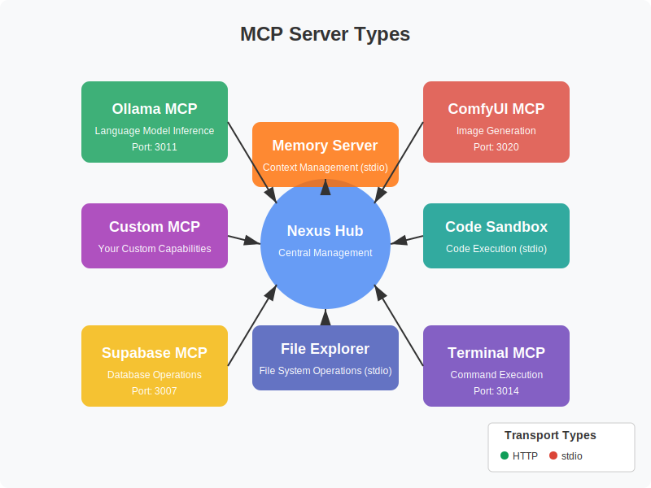

# Tutorial: Integrating a Custom MCP Server

## Introduction

This tutorial will guide you through the process of creating and integrating a custom MCP server with the Nexus MCP Hub. By the end of this tutorial, you'll have a functional MCP server that can be used by agents in the Nexus ecosystem.



## Prerequisites

Before you begin, make sure you have:

1. Installed and configured the Nexus MCP Hub
2. Node.js 16 or higher installed
3. Basic understanding of the Model Context Protocol (MCP)
4. Familiarity with JavaScript/TypeScript

## Step 1: Understand the Model Context Protocol

The Model Context Protocol (MCP) defines a standardized way for AI models to interact with tools, data sources, and other systems. Before creating a custom MCP server, it's essential to understand the core concepts of the protocol:

1. **Context**: The shared state between a model and its environment
2. **Tools**: Functions that models can call to interact with external systems
3. **Transport**: The communication layer between models and tools
4. **Messages**: Structured data exchanged between components

For more information, refer to the [official MCP specification](https://modelcontextprotocol.io).

## Step 2: Set Up the Project

Let's create a new project for our custom MCP server:

```bash
# Create a new directory
mkdir custom-mcp-server
cd custom-mcp-server

# Initialize a new Node.js project
npm init -y

# Install dependencies
npm install express cors body-parser dotenv
```

Create a basic project structure:

```bash
mkdir src
touch src/index.js
touch src/tools.js
touch .env
```

## Step 3: Define Your Tools

The core functionality of an MCP server is provided through tools. Let's define some simple tools in `src/tools.js`:

```javascript
// src/tools.js

// Tool: Calculate factorial
const calculateFactorial = {
  name: "calculate_factorial",
  description: "Calculate the factorial of a number",
  parameters: {
    type: "object",
    properties: {
      number: {
        type: "integer",
        description: "The number to calculate factorial for"
      }
    },
    required: ["number"]
  },
  execute: async (params) => {
    const { number } = params;

    if (number < 0) {
      throw new Error("Factorial is not defined for negative numbers");
    }

    let result = 1;
    for (let i = 2; i <= number; i++) {
      result *= i;
    }

    return {
      result: result,
      calculation: `${number}! = ${result}`
    };
  }
};

// Tool: Generate random number
const generateRandomNumber = {
  name: "generate_random_number",
  description: "Generate a random number within a range",
  parameters: {
    type: "object",
    properties: {
      min: {
        type: "integer",
        description: "The minimum value (inclusive)"
      },
      max: {
        type: "integer",
        description: "The maximum value (inclusive)"
      }
    },
    required: ["min", "max"]
  },
  execute: async (params) => {
    const { min, max } = params;

    if (min > max) {
      throw new Error("Minimum value must be less than or equal to maximum value");
    }

    const randomNumber = Math.floor(Math.random() * (max - min + 1)) + min;

    return {
      number: randomNumber,
      range: `${min}-${max}`
    };
  }
};

// Tool: Format text
const formatText = {
  name: "format_text",
  description: "Format text (uppercase, lowercase, title case)",
  parameters: {
    type: "object",
    properties: {
      text: {
        type: "string",
        description: "The text to format"
      },
      format: {
        type: "string",
        enum: ["uppercase", "lowercase", "titlecase"],
        description: "The format to apply"
      }
    },
    required: ["text", "format"]
  },
  execute: async (params) => {
    const { text, format } = params;

    let formattedText;
    switch (format) {
      case "uppercase":
        formattedText = text.toUpperCase();
        break;
      case "lowercase":
        formattedText = text.toLowerCase();
        break;
      case "titlecase":
        formattedText = text.replace(/\w\S*/g, (txt) => {
          return txt.charAt(0).toUpperCase() + txt.substr(1).toLowerCase();
        });
        break;
      default:
        throw new Error(`Unknown format: ${format}`);
    }

    return {
      original: text,
      formatted: formattedText,
      format: format
    };
  }
};

// Export all tools
module.exports = {
  calculateFactorial,
  generateRandomNumber,
  formatText,
  // Add more tools here
};
```

## Step 4: Implement the MCP Server

Now, let's implement the MCP server in `src/index.js`:

```javascript
// src/index.js
const express = require('express');
const cors = require('cors');
const bodyParser = require('body-parser');
const dotenv = require('dotenv');
const tools = require('./tools');

// Load environment variables
dotenv.config();

// Create Express app
const app = express();
app.use(cors());
app.use(bodyParser.json());

// Server configuration
const PORT = process.env.PORT || 3030;
const SERVER_ID = process.env.SERVER_ID || 'custom-mcp-server';
const SERVER_NAME = process.env.SERVER_NAME || 'Custom MCP Server';

// Get all tools as an array
const toolsArray = Object.values(tools);

// Health check endpoint
app.get('/health', (req, res) => {
  res.json({
    status: 'healthy',
    serverId: SERVER_ID,
    serverName: SERVER_NAME,
    toolCount: toolsArray.length
  });
});

// Server info endpoint
app.get('/info', (req, res) => {
  res.json({
    id: SERVER_ID,
    name: SERVER_NAME,
    description: 'A custom MCP server with utility tools',
    version: '1.0.0',
    transport: 'http',
    capabilities: ['utility', 'calculation', 'formatting'],
    tools: toolsArray.map(tool => ({
      name: tool.name,
      description: tool.description,
      parameters: tool.parameters
    }))
  });
});

// Tool execution endpoint
app.post('/v1/execute', async (req, res) => {
  try {
    const { tool, parameters } = req.body;

    // Find the requested tool
    const toolImplementation = toolsArray.find(t => t.name === tool);

    if (!toolImplementation) {
      return res.status(404).json({
        error: `Tool not found: ${tool}`,
        availableTools: toolsArray.map(t => t.name)
      });
    }

    // Execute the tool
    const result = await toolImplementation.execute(parameters);

    // Return the result
    res.json({
      id: `res_${Date.now()}`,
      tool: tool,
      parameters: parameters,
      result: result
    });
  } catch (error) {
    res.status(400).json({
      error: error.message
    });
  }
});

// Start the server
app.listen(PORT, () => {
  console.log(`Custom MCP Server running on port ${PORT}`);
  console.log(`Server ID: ${SERVER_ID}`);
  console.log(`Server Name: ${SERVER_NAME}`);
  console.log(`Available tools: ${toolsArray.map(t => t.name).join(', ')}`);
});
```

Create a `.env` file with the following content:

```
PORT=3030
SERVER_ID=custom-mcp-server
SERVER_NAME=Custom MCP Server
```

## Step 5: Start the MCP Server

Now, let's start our custom MCP server:

```bash
node src/index.js
```

You should see output similar to:

```
Custom MCP Server running on port 3030
Server ID: custom-mcp-server
Server Name: Custom MCP Server
Available tools: calculate_factorial, generate_random_number, format_text
```

## Step 6: Test the MCP Server

Let's test our MCP server using curl:

```bash
# Test health check
curl http://localhost:3030/health

# Test server info
curl http://localhost:3030/info

# Test calculate_factorial tool
curl -X POST http://localhost:3030/v1/execute \
  -H "Content-Type: application/json" \
  -d '{
    "tool": "calculate_factorial",
    "parameters": {
      "number": 5
    }
  }'

# Test generate_random_number tool
curl -X POST http://localhost:3030/v1/execute \
  -H "Content-Type: application/json" \
  -d '{
    "tool": "generate_random_number",
    "parameters": {
      "min": 1,
      "max": 100
    }
  }'

# Test format_text tool
curl -X POST http://localhost:3030/v1/execute \
  -H "Content-Type: application/json" \
  -d '{
    "tool": "format_text",
    "parameters": {
      "text": "hello world",
      "format": "titlecase"
    }
  }'
```

## Step 7: Register with Nexus MCP Hub

Now that our custom MCP server is running, let's register it with the Nexus MCP Hub:

```bash
# Register the MCP server
curl -X POST http://localhost:3000/api/mcp-servers \
  -H "Content-Type: application/json" \
  -H "Authorization: Bearer your-jwt-token" \
  -d '{
    "id": "custom-mcp-server",
    "name": "Custom MCP Server",
    "description": "A custom MCP server with utility tools",
    "url": "http://localhost",
    "port": 3030,
    "transport": "http",
    "capabilities": ["utility", "calculation", "formatting"],
    "tools": [
      {
        "name": "calculate_factorial",
        "description": "Calculate the factorial of a number",
        "parameters": {
          "type": "object",
          "properties": {
            "number": {
              "type": "integer",
              "description": "The number to calculate factorial for"
            }
          },
          "required": ["number"]
        }
      },
      {
        "name": "generate_random_number",
        "description": "Generate a random number within a range",
        "parameters": {
          "type": "object",
          "properties": {
            "min": {
              "type": "integer",
              "description": "The minimum value (inclusive)"
            },
            "max": {
              "type": "integer",
              "description": "The maximum value (inclusive)"
            }
          },
          "required": ["min", "max"]
        }
      },
      {
        "name": "format_text",
        "description": "Format text (uppercase, lowercase, title case)",
        "parameters": {
          "type": "object",
          "properties": {
            "text": {
              "type": "string",
              "description": "The text to format"
            },
            "format": {
              "type": "string",
              "enum": ["uppercase", "lowercase", "titlecase"],
              "description": "The format to apply"
            }
          },
          "required": ["text", "format"]
        }
      }
    ]
  }'
```

Alternatively, you can use the Nexus MCP Hub web interface:

1. Navigate to the MCP Servers page
2. Click "Register New Server"
3. Fill in the form with the values from our server
4. Click "Register Server"

## Step 8: Create an Agent That Uses Your MCP Server

Now, let's create an agent that uses our custom MCP server:

```bash
# Create an agent
curl -X POST http://localhost:3000/api/agents \
  -H "Content-Type: application/json" \
  -H "Authorization: Bearer your-jwt-token" \
  -d '{
    "id": "utility-agent",
    "name": "UtilityAgent",
    "description": "An agent that uses the custom MCP server for utility tasks",
    "type": "utility",
    "model": "llama3:8b",
    "mcpServers": ["custom-mcp-server"],
    "capabilities": ["utility", "calculation", "formatting"]
  }'
```

## Step 9: Test the Agent with Your MCP Server

Let's test our agent with a task that uses our custom MCP server:

```bash
# Create a task
curl -X POST http://localhost:3000/api/tasks \
  -H "Content-Type: application/json" \
  -H "Authorization: Bearer your-jwt-token" \
  -d '{
    "agentId": "utility-agent",
    "input": "Calculate the factorial of 10, generate a random number between 1 and 100, and format the text \"hello world\" in title case."
  }'
```

This will return a task ID:

```json
{
  "id": "task-123456",
  "agentId": "utility-agent",
  "status": "created"
}
```

You can check the task status:

```bash
# Check task status
curl -X GET http://localhost:3000/api/tasks/task-123456 \
  -H "Authorization: Bearer your-jwt-token"
```

## Step 10: Enhance Your MCP Server

Now that you have a basic MCP server working, you can enhance it with additional features:

### Add Authentication

```javascript
// Add authentication middleware
const authenticateApiKey = (req, res, next) => {
  const apiKey = req.headers['x-api-key'];

  if (!apiKey || apiKey !== process.env.API_KEY) {
    return res.status(401).json({ error: 'Invalid API key' });
  }

  next();
};

// Apply middleware to protected routes
app.use('/v1/execute', authenticateApiKey);
```

### Add Logging

```javascript
// Add logging middleware
const logRequest = (req, res, next) => {
  console.log(`[${new Date().toISOString()}] ${req.method} ${req.path}`);
  next();
};

// Apply middleware to all routes
app.use(logRequest);
```

### Add Rate Limiting

```javascript
// Simple rate limiting middleware
const rateLimit = {
  windowMs: 60 * 1000, // 1 minute
  maxRequests: 100, // 100 requests per minute
  clients: new Map(),

  middleware: function(req, res, next) {
    const clientIp = req.ip;
    const now = Date.now();

    if (!this.clients.has(clientIp)) {
      this.clients.set(clientIp, {
        count: 1,
        resetTime: now + this.windowMs
      });
      return next();
    }

    const client = this.clients.get(clientIp);

    if (now > client.resetTime) {
      client.count = 1;
      client.resetTime = now + this.windowMs;
      return next();
    }

    if (client.count >= this.maxRequests) {
      return res.status(429).json({
        error: 'Too many requests',
        retryAfter: Math.ceil((client.resetTime - now) / 1000)
      });
    }

    client.count++;
    next();
  }
};

// Apply rate limiting to execute endpoint
app.use('/v1/execute', rateLimit.middleware.bind(rateLimit));
```

## Step 11: Package Your MCP Server

To make your MCP server easier to distribute and deploy, you can package it as a Docker container:

Create a `Dockerfile`:

```dockerfile
FROM node:16-alpine

WORKDIR /app

COPY package*.json ./
RUN npm install --production

COPY src ./src
COPY .env.example ./.env

EXPOSE 3030

CMD ["node", "src/index.js"]
```

Create a `.env.example` file:

```
PORT=3030
SERVER_ID=custom-mcp-server
SERVER_NAME=Custom MCP Server
API_KEY=your-api-key
```

Build and run the Docker container:

```bash
# Build the Docker image
docker build -t custom-mcp-server .

# Run the container
docker run -p 3030:3030 -d custom-mcp-server
```

## Conclusion

Congratulations! You've created a custom MCP server, integrated it with the Nexus MCP Hub, and created an agent that uses your server. This demonstrates the extensibility of the Nexus ecosystem, allowing you to add custom capabilities to your agents.

As you become more familiar with the Model Context Protocol, you can create more sophisticated MCP servers with additional capabilities and integrations.

## Next Steps

- [Learn about different MCP server types](../mcp-servers/server-types.md)
- [Explore agent development](../agents/development-guide.md)
- [Understand MCP server security](../security/best-practices.md)
- [Create more complex workflows](../workflows/overview.md)
