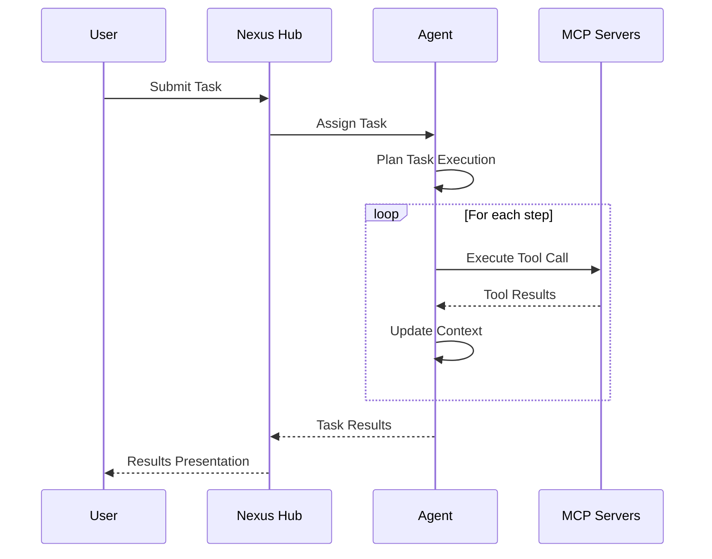
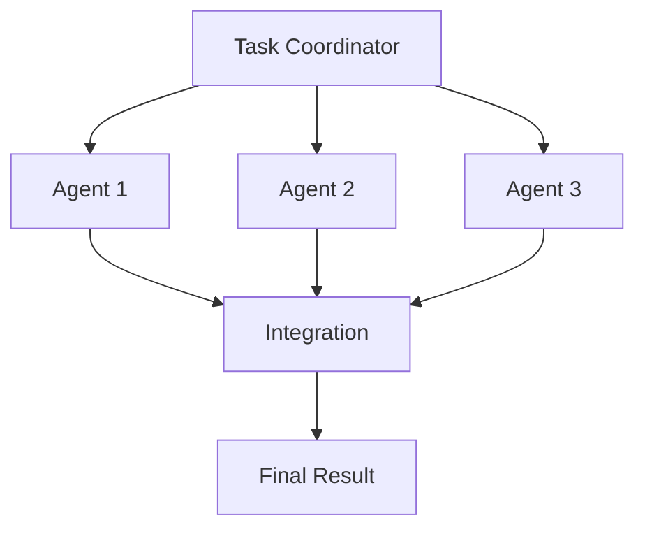

# User Workflows

## Introduction

This guide describes common user workflows in the Nexus MCP Hub, providing step-by-step instructions for key tasks and real-world use cases. It's designed to help users understand how to effectively use the system for various purposes.

## Core Workflows

### Agent Creation Workflow

Creating a new agent in the Nexus MCP Hub involves several steps:

1. **Define Purpose**
   - Identify the specific tasks the agent will perform
   - Determine the target users and use cases
   - Establish success criteria

2. **Select Model**
   - Choose an appropriate foundation model (e.g., Claude, GPT-4)
   - Consider factors like capabilities, context window, and cost
   - Select model parameters (temperature, max tokens, etc.)

3. **Choose MCP Servers**
   - Select MCP servers based on required capabilities
   - Ensure servers are registered with the Nexus Hub
   - Configure server access and authentication

4. **Configure Agent**
   - Set agent name, description, and type
   - Configure capabilities and parameters
   - Set up memory and context management

5. **Test and Deploy**
   - Test the agent with sample tasks
   - Gather feedback and metrics
   - Deploy the agent for production use

### Task Execution Workflow

Executing a task with an agent follows this workflow:

1. **Task Submission**
   - User submits a task through the UI or API
   - Task includes description, parameters, and constraints
   - Nexus Hub validates the task and assigns it to an agent

2. **Task Planning**
   - Agent analyzes the task and creates an execution plan
   - Plan includes required tools and steps
   - Agent allocates resources and prepares context

3. **Tool Execution**
   - Agent calls appropriate tools on MCP servers
   - Tools perform specific operations (code generation, data retrieval, etc.)
   - Results are returned to the agent

4. **Result Integration**
   - Agent integrates results from multiple tools
   - Context is updated with new information
   - Agent generates a comprehensive response

5. **Result Presentation**
   - Results are formatted for presentation
   - User receives the completed task results
   - Feedback is collected for improvement

### MCP Server Registration Workflow

Adding a new MCP server to the Nexus Hub:

1. **Server Implementation**
   - Implement the MCP specification
   - Configure server capabilities and tools
   - Set up authentication and security

2. **Server Deployment**
   - Deploy the server on a designated port
   - Ensure network connectivity with the Nexus Hub
   - Configure resource allocation

3. **Registration**
   - Register the server with the Nexus Hub
   - Provide server details (name, URL, port, etc.)
   - Specify capabilities and tools

4. **Validation**
   - Nexus Hub validates the server
   - Tests connectivity and tool functionality
   - Verifies authentication

5. **Activation**
   - Server is activated in the Nexus Hub
   - Made available to agents
   - Monitoring is enabled

## Use Case Workflows

### Software Development Workflow

Using the Nexus MCP Hub for software development:

1. **Project Setup**
   - Create a new project or connect to an existing one
   - Configure development environment
   - Set up version control

2. **Code Generation**
   - Describe features or components to implement
   - CodeAssistant agent generates code
   - Review and refine generated code

3. **Code Review**
   - Submit code for review
   - CodeAssistant analyzes code quality, security, and performance
   - Implement suggested improvements

4. **Testing**
   - Generate test cases
   - Execute tests and analyze results
   - Fix issues and improve test coverage

5. **Documentation**
   - Generate documentation for code
   - Create user guides and API references
   - Maintain documentation as code evolves

### Research and Analysis Workflow

Using the Nexus MCP Hub for research and analysis:

1. **Research Planning**
   - Define research questions and objectives
   - Identify information sources
   - Create research plan

2. **Information Gathering**
   - Librarian agent searches for relevant information
   - Retrieves documents and data
   - Organizes information in a structured format

3. **Data Analysis**
   - DataSage agent analyzes collected data
   - Identifies patterns and insights
   - Generates visualizations

4. **Synthesis**
   - Integrate information from multiple sources
   - Generate comprehensive analysis
   - Create summary and recommendations

5. **Report Generation**
   - Create detailed research report
   - Include visualizations and citations
   - Format for target audience

### Creative Content Creation Workflow

Using the Nexus MCP Hub for creative content creation:

1. **Concept Development**
   - Define content goals and audience
   - Generate creative concepts
   - Select and refine concepts

2. **Content Creation**
   - Muse agent generates written content
   - Creates images and visual elements
   - Integrates text and visuals

3. **Refinement**
   - Review and edit content
   - Improve quality and coherence
   - Ensure alignment with goals

4. **Publication**
   - Format content for target platforms
   - Prepare for distribution
   - Schedule publication

5. **Analysis**
   - Track content performance
   - Gather audience feedback
   - Identify improvement opportunities

## Advanced Workflows

### Multi-Agent Collaboration

Using multiple agents to solve complex problems:

1. **Task Decomposition**
   - Break complex task into subtasks
   - Assign subtasks to specialized agents
   - Define integration points

2. **Parallel Execution**
   - Agents work on subtasks simultaneously
   - Share context and intermediate results
   - Coordinate through the Nexus Hub

3. **Result Integration**
   - Combine results from multiple agents
   - Resolve conflicts and inconsistencies
   - Create coherent final output

4. **Quality Assurance**
   - Validate integrated results
   - Ensure all requirements are met
   - Refine as needed

### Continuous Learning Workflow

Improving agent performance through continuous learning:

1. **Performance Monitoring**
   - Track agent performance metrics
   - Identify strengths and weaknesses
   - Compare against benchmarks

2. **Feedback Collection**
   - Gather user feedback
   - Collect success and failure cases
   - Document edge cases

3. **Model Refinement**
   - Adjust model parameters
   - Update prompts and instructions
   - Enhance tool selection logic

4. **Capability Expansion**
   - Add new capabilities
   - Integrate additional MCP servers
   - Extend context management

5. **Validation**
   - Test improvements
   - Verify performance gains
   - Deploy updated agent

## Workflow Integration

### Integration with Development Tools

Integrating the Nexus MCP Hub with development tools:

1. **IDE Integration**
   - VS Code extension for direct access
   - IntelliJ plugin for Java development
   - Command palette commands

2. **CI/CD Integration**
   - GitHub Actions integration
   - Jenkins pipeline integration
   - Automated testing and deployment

3. **Project Management Integration**
   - Jira integration for task tracking
   - Trello integration for kanban boards
   - Notion integration for documentation

### Integration with Research Tools

Integrating with research and analysis tools:

1. **Database Integration**
   - SQL database connections
   - NoSQL database access
   - Data warehouse integration

2. **Analytics Integration**
   - Jupyter Notebook integration
   - Tableau connection
   - Power BI integration

3. **Knowledge Management Integration**
   - Notion integration
   - Obsidian connection
   - Wiki systems integration

## Workflow Customization

### Creating Custom Workflows

Building custom workflows for specific needs:

1. **Workflow Definition**
   - Define workflow steps and logic
   - Specify inputs and outputs
   - Set conditions and branches

2. **Agent Configuration**
   - Configure agents for workflow steps
   - Set up inter-agent communication
   - Define fallback mechanisms

3. **Integration Setup**
   - Connect with external systems
   - Configure data exchange
   - Set up authentication

4. **Testing and Deployment**
   - Test workflow with sample data
   - Validate results and performance
   - Deploy for production use

### Workflow Templates

The Nexus MCP Hub provides templates for common workflows:

1. **Software Development Templates**
   - Feature development workflow
   - Bug fixing workflow
   - Code review workflow

2. **Research Templates**
   - Literature review workflow
   - Data analysis workflow
   - Report generation workflow

3. **Content Creation Templates**
   - Blog post creation workflow
   - Social media content workflow
   - Documentation workflow

## Best Practices

### Workflow Efficiency

Tips for creating efficient workflows:

1. **Clear Task Definition**
   - Provide specific instructions
   - Include all necessary context
   - Define expected outputs

2. **Appropriate Agent Selection**
   - Choose agents based on task requirements
   - Consider agent specializations
   - Use multi-agent collaboration for complex tasks

3. **Optimal Tool Usage**
   - Select the right tools for each step
   - Minimize unnecessary tool calls
   - Cache results when appropriate

4. **Context Management**
   - Maintain relevant context
   - Prune unnecessary information
   - Use structured context formats

### Workflow Monitoring

Monitoring workflow execution:

1. **Performance Tracking**
   - Monitor execution time
   - Track resource usage
   - Measure success rates

2. **Error Handling**
   - Implement robust error handling
   - Provide meaningful error messages
   - Create recovery mechanisms

3. **Audit Logging**
   - Log all significant actions
   - Track decision points
   - Maintain audit trail

## Troubleshooting

### Common Workflow Issues

1. **Task Misinterpretation**
   - Agent misunderstands the task
   - Results don't match expectations
   - Solution: Provide clearer instructions and examples

2. **Tool Failures**
   - Tools return errors or unexpected results
   - MCP servers are unavailable
   - Solution: Implement fallback mechanisms and retry logic

3. **Context Limitations**
   - Important information is lost
   - Context becomes too large
   - Solution: Optimize context management and summarization

4. **Performance Bottlenecks**
   - Workflows take too long to complete
   - Resource usage is excessive
   - Solution: Optimize tool usage and parallelize when possible

## Next Steps

After mastering basic workflows:

1. Create custom workflows for your specific needs
2. Integrate with your existing tools and systems
3. Contribute workflow templates to the community
4. Explore advanced features and capabilities

For more information, refer to the following resources:

- [System Architecture Overview](../architecture/system-overview.md)
- [Agent Development Guide](../agents/development-guide.md)
- [API Reference](../api/reference.md)
- [Deployment Guide](../deployment/guide.md)
